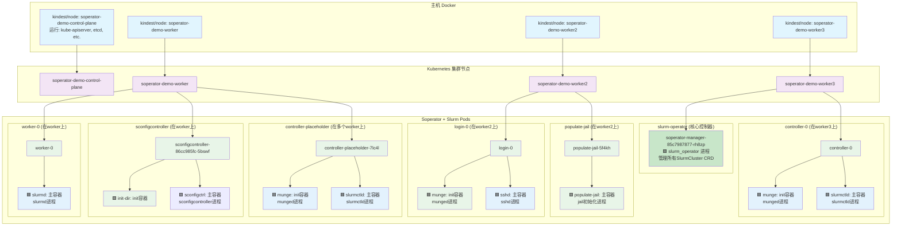

# Soperator Demo 架构说明

## Kind 集群架构层次

Soperator demo 使用 Kind (Kubernetes in Docker) 运行，形成了多层容器架构。理解这个架构对于调试和监控非常��要。

## 架构对应关系图



## 容器和进程详解

### 🎯 **最关键的 Soperator 进程**

| 进程名 | 部署位置 | Pod/容器 | 作用 | 为什么必需 |
|--------|----------|----------|------|------------|
| **slurm_operator** | `soperator` 命名空间 | `soperator-manager-xxx`<br/>manager 容器 | 🟩 **核心控制器**<br/>管理所有 SlurmCluster CRD | 没有它，整个 Slurm 集群无法运行 |

#### **查看 slurm_operator 进程的命令**
```bash
# 查看 Pod 运行状态
kubectl get pods -n soperator -o wide

# 查看 slurm_operator 进程
kubectl exec -n soperator soperator-manager-xxx -c manager -- ps aux | grep slurm_operator

# 查看 slurm_operator 日志
kubectl logs -n soperator soperator-manager-xxx -c manager

# 查看启动参数
kubectl get pod soperator-manager-xxx -n soperator -o jsonpath='{.spec.containers[0].args}'
```

### 🎯 **Soperator 集群中的进程分类**

| Pod 名称 | 容器类型 | 容器名称 | 关键进程 | 进程来源 | 作用描述 |
|---------|----------|----------|----------|----------|----------|
| controller-0 | init容器 | munge | `munged` | 🟦 **Slurm外部项目** | Slurm认证服务，提供节点间身份验证 |
| controller-0 | 主容器 | slurmctld | `slurmctld` | 🟦 **Slurm外部项目** | Slurm主控制器，管理作业调度和资源分配 |
| worker-0 | 主容器 | slurmd | `slurmd` | 🟦 **Slurm外部项目** | Slurm工作节点守护进程，执行作业任务 |
| login-0 | init容器 | munge | `munged` | 🟦 **Slurm外部项目** | Slurm认证服务，与其他节点通信 |
| login-0 | 主容器 | sshd | `sshd` | 🟦 **OpenSSH项目** | SSH服务，提供用户登录访问 |
| sconfigcontroller | init容器 | init-dir | - | 🟩 **Soperator项目** | 初始化配置目录和权限 |
| sconfigcontroller | 主容器 | sconfigctrl | `sconfigcontroller` | 🟩 **Soperator项目** | Slurm配置管理控制器 |
| populate-jail | 主容器 | populate-jail | jail初始化脚本 | 🟩 **Soperator项目** | 初始化jail环境，设置共享文件系统 |
| controller-placeholder | init容器 | munge | `munged` | 🟦 **Slurm外部项目** | 备用认证服务 |
| controller-placeholder | 主容器 | slurmctld | `slurmctld` | 🟦 **Slurm外部项目** | 备用Slurm控制器（高可用） |

### 🎨 **颜色标记说明**

- 🟦 **Slurm外部项目进程**（蓝色）：
  - `slurmctld` - Slurm 主控制器（[Slurm官方项目](https://github.com/SchedMD/slurm)）
  - `slurmd` - Slurm 工作节点（[Slurm官方项目](https://github.com/SchedMD/slurm)）
  - `munged` - 认证服务（[Munge项目](https://github.com/dun/munge)）
  - `sshd` - SSH 服务（[OpenSSH项目](https://www.openssh.com/)）

- 🟩 **Soperator项目进程**（绿色）：
  - `sconfigcontroller` - Slurm 配置管理控制器（本项目编译生成）
  - `populate-jail` - 文件系统初始化（本项目提供）
  - `init-dir` - 配置目录初始化（本项目提供）

**核心区别**：
- 🟦 **Slurm 组件**：提供 HPC 作业调度的核心功能
- 🟩 **Soperator 组件**：管理 Slurm 在 Kubernetes 上的部署和运行

### 📋 **Soperator 核心二进制部署位置**

| Soperator 二进制 | 实际进程名 | 部署位置 | Pod/容器 | 作用 |
|-----------------|-----------|----------|----------|------|
| **slurm-operator** | `slurm_operator` | `soperator` 命名空间 | `soperator-manager-xxx` | 🟩 Kubernetes Operator 主控制器（必需） |
| **sconfigcontroller** | `sconfigcontroller` | Slurm 集群命名空间 | `sconfigcontroller-xxx` | 🟩 Slurm 配置管理控制器 |
| **exporter** | `soperator-exporter` | 可选部署 | `slurm-exporter-xxx` | 🟩 Prometheus 指标导出器 |
| **rebooter** | `slurm-rebooter` | 可选部署 | `slurm-rebooter-xxx` | 🟩 节点重启管理器 |
| **soperatorchecks** | `soperator-checks` | 可选部署 | `soperator-checks-xxx` | 🟩 健康检查组件 |

### 🏢 Kubernetes 系统进程（非本项目生成）
| 节点 | 进程 | 作用 | 来源 |
|------|------|------|------|
| control-plane | etcd, kube-apiserver, kube-scheduler, kube-controller-manager | Kubernetes 集群大脑和控制 | Kindest/node 基础镜像 |
| 所有节点 | kubelet, kube-proxy, containerd | 节点代理和容器运行时 | Kindest/node 基础镜像 |

## Control-plane 节点为什么没有 Slurm Pod？

### 🔸 节点过滤策略

Soperator 使用**节点过滤器**来控制 Slurm 组件的部署位置：

```yaml
# SlurmCluster 配置中的节点过滤器
spec:
  slurmNodes:
    controller:
      k8sNodeFilterName: cpu  # 只在带有 cpu 标签的节点上部署
    worker:
      k8sNodeFilterName: cpu
    login:
      k8sNodeFilterName: cpu
```

### 🔸 节点标签对比

| 节点 | 角色 | 标签 | 是否运行Slurm |
|------|------|------|--------------|
| soperator-demo-control-plane | control-plane | `node-role.kubernetes.io/control-plane=` | ❌ 不运行 |
| soperator-demo-worker | worker | `nebius.com/node-group-id=node-group-id-here` | ✅ 运行 |
| soperator-demo-worker2 | worker | `nebius.com/node-group-id=node-group-id-here` | ✅ 运行 |
| soperator-demo-worker3 | worker | `nebius.com/node-group-id=node-group-id-here` | ✅ 运行 |

### 🔸 这是正确的设计模式

**Kubernetes 最佳实践要求：**
- **Control-plane节点**: 专门运行Kubernetes系统组件（kube-apiserver, etcd等）
- **Worker节点**: 运行用户工作负载（Slurm, 应用程序等）
- **节点隔离**: 通过污点（taints）和容忍（tolerations）实现隔离

**优势：**
1. **安全性**: 系统组件与用户工作负载隔离
2. **稳定性**: 避免用户应用影响Kubernetes控制平面
3. **性能**: 专用节点处理特定工作负载
4. **可维护性**: 独立扩缩容和升级

## 架构层次详解

### 🔸 第一层：主机 Docker 层
- **作用**: 运行 Kind 集群节点容器
- **容器类型**: `kindest/node` 镜像
- **查看方式**: `docker ps`
- **特点**: 这是在主机上唯一能直接看到的容器层

### 🔸 第二层：Kubernetes 集群节点层
- **作用**: Kubernetes 集群的基础设施
- **节点类型**: control-plane, worker nodes
- **查看方式**: `kubectl get nodes`
- **特点**: **严格1:1映射关系** - 每个Docker容器对应一个Kubernetes节点，运行完整的kubelet和containerd组件

### 🔸 第三层：Pod 层
- **作用**: 运行 Slurm 集群组件
- **Pod 类型**: controller, login, worker, sconfigcontroller 等
- **查看方式**: `kubectl get pods`
- **特点**: Kubernetes 的最小部署单元，包含一个或多个容器

### 🔸 第四层：容器层
- **作用**: 实际运行的应用程序
- **容器类型**: slurmctld, slurmd, sshd, munge, sconfigctrl 等
- **查看方式**: 在节点内使用 `crictl ps`
- **特点**: 真正执行 Slurm 相关服务的容器

## 查看命令集合

### 第一层：主机 Docker 层
```bash
# 查看所有 Docker 容器（Kind 集群节点）
docker ps

# 查看所有容器（包括停止的）
docker ps -a

# 查看 Kind 集群节点详细信息
docker inspect soperator-demo-control-plane
docker inspect soperator-demo-worker
```

### 第二层：Kubernetes 集群节点层
```bash
# 查看所有节点
kubectl get nodes -o wide

# 查看节点详细信息
kubectl describe node soperator-demo-worker2

# 查看节点上的 Pod
kubectl get pods -o wide --field-selector spec.nodeName=soperator-demo-worker2

# 查看节点资源使用情况
kubectl top nodes
```

### 第三层：Pod 层
```bash
# 查看所有命名空间的 Pod
kubectl get pods --all-namespaces -o wide

# 查看 Slurm 集群的 Pod
kubectl get pods -n correct-cpu-cluster -o wide

# 查看 Pod 详细信息
kubectl describe pod controller-0 -n correct-cpu-cluster
kubectl describe pod login-0 -n correct-cpu-cluster

# 查看 Pod 的 YAML 配置
kubectl get pod controller-0 -n correct-cpu-cluster -o yaml

# 查看 Pod 事件
kubectl get events -n correct-cpu-cluster --sort-by=.metadata.creationTimestamp
```

### 第四层：容器层（节点内部）
```bash
# 进入指定节点查看容器
docker exec -it soperator-demo-worker2 crictl ps
docker exec -it soperator-demo-worker2 crictl images

# 查看容器详细信息
docker exec -it soperator-demo-worker2 crictl inspect <container-id>

# 查看容器日志
docker exec -it soperator-demo-worker2 crictl logs <container-id>

# 在所有节点上查看容器
for node in soperator-demo-control-plane soperator-demo-worker soperator-demo-worker2 soperator-demo-worker3; do
    echo "=== $node ==="
    docker exec $node crictl ps | grep -E "(slurm|login|munge|sconfig)"
done
```

## 组合查看命令

### 查看所有 Slurm 相关容器
```bash
#!/bin/bash
echo "=== Slurm 容器分布情况 ==="
for node in $(kubectl get nodes -o name | cut -d'/' -f2); do
    echo "📍 Node: $node"
    docker exec $node crictl ps | grep -E "(slurm|login|munge|sconfig|jail)" || echo "  无 Slurm 容器"
    echo ""
done
```

### 查看 Pod 和容器映射关系
```bash
kubectl get pods -n correct-cpu-cluster -o custom-columns=NAME:.metadata.name,READY:.status.readyReplicas,CONTAINERS:.spec.containers[*].name,INIT_CONTAINERS:.spec.initContainers[*].name
```

## 当前 Pod 状态分析

根据当前集群状态：

| Docker 容器 | Kubernetes 节点 | Pod 名称 | 状态 | 容器数 | 作用 |
|-------------|----------------|---------|------|--------|------|
| soperator-demo-worker3 | soperator-demo-worker3 | controller-0 | CrashLoopBackOff | 1/2 | Slurm 主控制器（有问题） |
| soperator-demo-worker | soperator-demo-worker | controller-placeholder-7lc4l | Running | 2/2 | Slurm 控制器占位符 |
| soperator-demo-worker2 | soperator-demo-worker2 | controller-placeholder-849m5 | Running | 2/2 | Slurm 控制器占位符 |
| soperator-demo-worker3 | soperator-demo-worker3 | controller-placeholder-mdclb | Running | 2/2 | Slurm 控制器占位符 |
| soperator-demo-worker2 | soperator-demo-worker2 | login-0 | Running | 2/2 | SSH 登录节点 |
| soperator-demo-worker | soperator-demo-worker | worker-0 | Running | 1/1 | Slurm 工作节点 |
| soperator-demo-worker | soperator-demo-worker | sconfigcontroller-86cc985fc-5bswf | Running | 1/1 | Slurm 配置控制器 |
| soperator-demo-worker2 | soperator-demo-worker2 | populate-jail-5f4kh | Completed | 0/1 | 初始化作业容器 |

## Kind 工作原理详解

### 🔸 Kind 是什么？
Kind (Kubernetes in Docker) 将 Kubernetes 组件直接运行在 Docker 容器内，而不是���用虚拟机。每个 Kind 容器就是一个完整的 Kubernetes 节点。

### 🔸 1:1 映射关系
```
Docker 容器                    Kubernetes 节点
soperator-demo-control-plane  ↔ soperator-demo-control-plane
soperator-demo-worker         ↔ soperator-demo-worker
soperator-demo-worker2        ↔ soperator-demo-worker2
soperator-demo-worker3        ↔ soperator-demo-worker3
```

### 🔸 每个容器内运行的组件
- **控制平面容器**: kube-apiserver, kube-controller-manager, kube-scheduler, etcd, kubelet, kube-proxy
- **工作节点容器**: kubelet, kube-proxy, containerd, 以及您的 Pod

### 🔸 为什么可以用 kubectl 直接操作？
Kind 通过端口转发将主机连接到控制平面容器：
```
主机:127.0.0.1:62377 → 容器:6443 (kube-apiserver)
```

### 🔸 验证1:1映射
```bash
# 查看 Docker 容器
docker ps | grep soperator-demo

# 查看 Kubernetes 节点
kubectl get nodes -o wide

# 验证IP地址对应
docker exec soperator-demo-worker2 hostname -I
kubectl get node soperator-demo-worker2 -o jsonpath='{.status.addresses[?(@.type=="InternalIP")].address}'
```

## 常见问题

### Q: 为什么在主机上看不到 Slurm 容器？
A: Slurm 容器运行在 Kind 集群节点容器内部，需要进入节点容器后使用 `crictl` 查看。

### Q: 如何查看崩溃容器的日志？
A:
```bash
# 查看 Pod 日志
kubectl logs controller-0 -n correct-cpu-cluster

# 查看特定容器日志
kubectl logs controller-0 -c slurmctld -n correct-cpu-cluster

# 查看节点内容器日志
docker exec soperator-demo-control-plane crictl logs <container-id>
```

### Q: 如何进入容器调试？
A:
```bash
# 进入 Pod 内的指定容器
kubectl exec -it controller-0 -c slurmctld -n correct-cpu-cluster -- /bin/bash

# 进入节点内的容器
docker exec -it soperator-demo-control-plane crictl exec <container-id> /bin/bash
```

## 总结

这个多层容器架构提供了完整的 Kubernetes 集群环境，同时保持了与主机的隔离。理解这个层次结构对于有效调试和管理 Slurm 集群至关重要。

---

# Soperator 使用场景详解

## 🎯 核心使用场景

Soperator 是一个 Kubernetes Operator，用于在 Kubernetes 上运行和管理 Slurm HPC 集群。

### 📝 用户提交作业场景

#### **方式1：通过登录节点（推荐）**
```bash
# SSH 登录到 login-0 节点
ssh -p 30022 soperator@localhost

# 准备作业脚本
cat > my_job.sh << EOF
#!/bin/bash
#SBATCH --ntasks=2
#SBATCH --time=10:00
#SBATCH --output=job_%j.out
./my_hpc_application
EOF

# 提交作业
sbatch my_job.sh

# 查看作业状态
squeue
scontrol show job <job_id>

# 查看结果
cat job_<job_id>.out
```

#### **方式2：通过 kubectl exec**
```bash
kubectl exec -it login-0 -n correct-cpu-cluster -- bash
sbatch job_script.sh
srun --ntasks=4 ./my_application
```

### 🔧 集群管理场景

#### **管理员日常运维**
```bash
# 1. 集群状态检查
kubectl get slurmclusters -A
kubectl describe slurmcluster correct-cpu-cluster -n correct-cpu-cluster

# 2. 监控 Pod 状态
kubectl get pods -n correct-cpu-cluster
kubectl logs -n correct-cpu-cluster -l app.kubernetes.io/component=controller

# 3. 通过 Helm 管理集群配置
helm upgrade correct-cpu-cluster ./helm-charts/slurm-cluster -n correct-cpu-cluster
```

### 🔄 扩容缩容场景

#### **手动扩容缩容**
```bash
# 1. 编辑 SlurmCluster 配置
kubectl edit slurmcluster correct-cpu-cluster -n correct-cpu-cluster

# 2. 修改 worker 数量
spec:
  slurmNodes:
    worker:
      size: 4  # 从 2 扩容到 4

# 3. 应用配置
kubectl apply -f updated-cluster.yaml

# 4. 监控扩容进度
kubectl get pods -n correct-cpu-cluster -w
```

#### **自动扩容缩容**
```yaml
# 通过 SlurmCluster CRD 配置
apiVersion: slurm.nebius.ai/v1
kind: SlurmCluster
metadata:
  name: correct-cpu-cluster
spec:
  slurmNodes:
    worker:
      size: 2  # 初始大小
      maxUnavailable: 20%  # 滚动更新策略
```

### 📊 典型使用流程

#### **科研用户日常使用**
```bash
# 1. 登录集群
ssh -p 30022 user@research-cluster.company.com

# 2. 交互式调试
srun --pty --ntasks=1 bash

# 3. 批量作业提交
sbatch --array=1-100%10 array_job.sh

# 4. 监控作业
squeue -u $USER
sstat -j <job_id>

# 5. 获取结果
scp user@research-cluster.company.com:~/results/* ./
```

#### **集群管理员日常运维**
```bash
# 1. 集群状态检查
kubectl get slurmclusters -A
kubectl describe slurmcluster my-cluster -n my-namespace

# 2. 配置更新
helm upgrade my-cluster ./helm-charts/slurm-cluster \
  --set slurmNodes.worker.size=10 \
  --set slurmNodes.controller.resources.memory=2Gi

# 3. 故障排查
kubectl logs -n my-namespace controller-0
kubectl exec -it login-0 -n my-namespace -- scontrol show nodes

# 4. 性能监控
kubectl top pods -n my-namespace
kubectl get events -n my-namespace --sort-by=.metadata.creationTimestamp
```

### 🎯 实际生产环境场景

#### **场景1：机器学习训练作业**
```bash
# 研究员提交分布式训练作业
sbatch --ntasks=8 --cpus-per-task=4 --mem=32G \
       --output=training_%j.out \
       --time=04:00:00 \
       ./distributed_training.sh
```

#### **场景2：基因组分析批处理**
```bash
# 生物信息学家提交大批量分析作业
sbatch --array=1-1000%50 \
       --cpus-per-task=8 \
       --mem=16G \
       --partition=batch \
       ./genome_analysis.sh
```

#### **场景3：动态资源扩容**
```bash
# 管理员根据作业队列长度动态扩容
kubectl patch slurmcluster ml-cluster -n ml-namespace \
  --type='merge' \
  -p='{"spec":{"slurmNodes":{"worker":{"size":15}}}}'

# 监控扩容进度
watch kubectl get pods -n ml-namespace -l app.kubernetes.io/component=worker
```

## 💡 核心价值

**Soperator 将传统 HPC Slurm 工作负载容器化，在 Kubernetes 上运行：**

- **用户层面**: 使用标准 Slurm 命令，无学习成本
- **管理员层面**: 通过 kubectl 和 helm 管理集群
- **自动化层面**: 自动扩容、故障恢复、弹性调度

---

# Slurm CPU 集群演示脚本

这个目录包含了 Slurm on Kubernetes CPU 集群的完整演示脚本。

## 📋 脚本使用顺序

### 1️⃣ 基础集群检查
```bash
./01-check-cluster.sh
```
检查命名空间、Pod、服务和存储的基本状态。

### 2️⃣ 登录节点访问
```bash
./02-access-login.sh
```
验证登录节点的环境、存储挂载和网络连通性。

### 3️⃣ Slurm 状态分析
```bash
./03-slurm-status-real.sh
```
深入分析 Slurm 集群的真实部署状态和架构组件。

### 4️⃣ 作业调度演示
```bash
./04-job-demo.sh
```
展示 Slurm 作业调度概念和容器化作业执行。

### 5️⃣ 部署总结
```bash
./05-final-status.sh
```
提供完整的部署总结和下一步学习建议。

## 🎯 学习目标

通过这些脚本，你将学习到：

- ✅ Soperator 纯 CPU 集群支持能力
- ✅ HPC 工作负载容器化流程
- ✅ Kubernetes 管理 Slurm 架构的方法
- ✅ 云原生 HPC 基础设施概念
- ✅ 实际生产环境中的挑战和解决方案

## ⚠️ 技术说明

当前部署遇到一些集成挑战，这些都是复杂 HPC 容器化部署中的常见问题：

- DNS SRV 记录解析配置
- Munge 认证系统设置
- Slurm 配置文件优化

这些挑战本身就是宝贵的学习经验，反映了真实生产环境中的复杂性。

## 🚀 开始使用

从第1步开始，按顺序执行所有脚本：

```bash
./01-check-cluster.sh && ./02-access-login.sh && ./03-slurm-status-real.sh && ./04-job-demo.sh && ./05-final-status.sh
```

或者一次性运行完整演示：

```bash
for script in 0*.sh; do echo "=== 运行 $script ===" && ./$script && echo ""; done
```

享受你的 HPC 容器化学习之旅！🎉