# 程序入口与启动流程 (Entrypoint & Startup Flow)

## 入口函数文件

本项目包含 5 个独立的 Go 程序，每个都有自己独立的 `main()` 函数：

### 主操作器 (Main Operator)
- **文件**: [cmd/main.go](cmd/main.go:117)
- **用途**: 主要的 Slurm 操作器，管理整个集群生命周期
- **启动命令**: `make run` 或 `go run cmd/main.go`

### 检查工具 (Health Checker)
- **文件**: [cmd/soperatorchecks/main.go](cmd/soperatorchecks/main.go:102)
- **用途**: 健康检查和监控服务，管理 Slurm 节点和 K8S 节点状态
- **启动命令**: `go run cmd/soperatorchecks/main.go`

### 重启工具 (Rebooter)
- **文件**: [cmd/rebooter/main.go](cmd/rebooter/main.go:95)
- **用途**: 节点重启管理，处理节点故障恢复
- **启动命令**: `go run cmd/rebooter/main.go`

### 配置控制器 (Config Controller)
- **文件**: [cmd/sconfigcontroller/main.go](cmd/sconfigcontroller/main.go:99)
- **用途**: Slurm 配置管理，处理 jailed 配置
- **启动命令**: `go run cmd/sconfigcontroller/main.go`

### 指标导出器 (Metrics Exporter)
- **文件**: [cmd/exporter/main.go](cmd/exporter/main.go:185)
- **用途**: Prometheus 指标导出，收集 Slurm 集群指标
- **启动命令**: `go run cmd/exporter/main.go`

## CLI 框架

本项目使用 **Go 标准库 `flag` 包** 作为 CLI 框架，未使用第三方 CLI 框架（如 cobra、urfave/cli 等）。

### 主操作器命令行参数

```bash
# 基础配置
--metrics-bind-address=:8080          # 指标服务绑定地址
--health-probe-bind-address=:8081     # 健康检查绑定地址
--metrics-secure=false                # 是否安全启用指标服务
--enable-http2=false                  # 是否启用 HTTP/2
--log-format=json                     # 日志格式：json 或 plain
--log-level=debug                      # 日志级别：debug, info, warn, error, dpanic, panic, fatal

# 集群管理
--leader-elect=true                    # 启用领导者选举
--operator-namespace=soperator-system   # 操作器命名空间
--enable-topology-controller=false     # 启用拓扑控制器

# 性能调优
--max-concurrent-reconciles=1          # 并发协调数量
--cache-sync-timeout=2m               # 缓存同步超时
--reconcile-timeout=3m                # 协调超时时间

# 特定功能
--enable-node-replacement=true        # 启用节点替换
--delete-not-ready-nodes=true         # 删除未就绪节点
--not-ready-timeout=15m               # 未就绪节点超时
--ephemeral-storage-threshold=85.0     # 临时存储使用阈值
```

### 其他组件命令行参数

#### 检查工具 (soperatorchecks)
```bash
--pod-ephemeral-max-concurrent-reconciles=10    # Pod 临时存储检查并发数
--pod-ephemeral-reconcile-timeout=15s           # Pod 临时存储协调超时
```

#### 重启工具 (rebooter)
```bash
--reconcile-timeout=3m                          # 协调超时
--cache-sync-timeout=2m                         # 缓存同步超时
```

#### 配置控制器 (sconfigcontroller)
```bash
--jail-path=/mnt/jail                           # Jail 路径
--cluster-namespace=default                    # 集群命名空间
--cluster-name=soperator                        # 集群名称
--slurmapiserver=http://localhost:6820          # Slurm API 服务器
--reconfigure-poll-interval=20s                 # 重配置轮询间隔
--reconfigure-wait-timeout=1m                   # 重配置等待超时
```

#### 指标导出器 (exporter)
```bash
--cluster-name=<required>                       # 集群名称（必需）
--cluster-namespace=soperator                   # 集群命名空间
--slurm-api-server=http://localhost:6820        # Slurm API 服务器
--collection-interval=30s                       # 指标收集间隔
--standalone                                   # 独立运行模式
--kubeconfig-path=                             # Kubeconfig 路径
--static-token=                               # 静态令牌
--scontrol-path=scontrol                       # Scontrol 路径
--key-rotation-interval=30m                    # 密钥轮换间隔
```

## 服务框架

### 主要框架：Kubernetes Controller Runtime

所有组件都基于 **sigs.k8s.io/controller-runtime** 框架构建，这是一个专门为 Kubernetes 控制器设计的运行时。

#### 核心组件架构

```go
// 1. Manager 初始化
mgr, err := ctrl.NewManager(ctrl.GetConfigOrDie(), ctrl.Options{
    Scheme: scheme,
    Metrics: metricsserver.Options{
        BindAddress:   metricsAddr,
        SecureServing: secureMetrics,
        TLSOpts:       tlsOpts,
    },
    WebhookServer:          webhookServer,
    HealthProbeBindAddress: probeAddr,
    LeaderElection:         enableLeaderElection,
    LeaderElectionID:       "unique-id.nebius.ai",
    Cache: cache.Options{
        DefaultNamespaces: watchNsCacheByName,
    },
})

// 2. Controller 注册
if err = controller.NewReconciler(...).SetupWithManager(mgr, maxConcurrency, cacheSyncTimeout); err != nil {
    setupLog.Error(err, "unable to create controller")
    os.Exit(1)
}

// 3. 服务启动
if err := mgr.Start(ctrl.SetupSignalHandler()); err != nil {
    setupLog.Error(err, "problem running manager")
    os.Exit(1)
}
```

#### 多协议服务支持

| 组件 | HTTP 服务 | Metrics 服务 | Webhook 服务 | 健康检查 |
|------|-----------|-------------|-------------|----------|
| Main Operator | ✅ | ✅ | ✅ | ✅ |
| soperatorchecks | ✅ | ✅ | ❌ | ✅ |
| rebooter | ✅ | ✅ | ❌ | ✅ |
| sconfigcontroller | ✅ | ✅ | ❌ | ✅ |
| exporter | ✅ | ✅ | ❌ | ✅ |

#### 指标导出器特殊架构

指标导出器使用自定义架构，不依赖 controller-runtime：

```go
// 双服务启动
if err := clusterExporter.Start(ctx, flags.metricsAddr); err != nil {
    log.Error(err, "Failed to start metrics exporter")
    os.Exit(1)
}

if err := clusterExporter.StartMonitoring(ctx, flags.monitoringAddr); err != nil {
    log.Error(err, "Failed to start monitoring server")
    os.Exit(1)
}
```

## 启动顺序流程图

```mermaid
graph TB
    subgraph "配置加载阶段"
        A[程序启动] --> B[解析命令行参数]
        B --> C[加载环境变量]
        C --> D[初始化日志配置]
    end

    subgraph "依赖初始化阶段"
        D --> E[Kubernetes 客户端初始化]
        E --> F[Scheme 注册]
        F --> G[控制器运行时 Manager 初始化]
        G --> H[TLS/HTTP 安全配置]
    end

    subgraph "控制器注册阶段"
        H --> I[主控制器注册]
        I --> J[集群控制器<br/>SlurmClusterController]
        J --> K[节点配置控制器<br/>NodeConfiguratorController]
        K --> L[节点分组控制器<br/>NodeSetController]
        L --> M[拓扑控制器<br/>TopologyController]
        M --> N[Webhook 注册<br/>SecretWebhook]
    end

    subgraph "服务启动阶段"
        N --> O[指标服务器启动<br/>metrics-server]
        O --> P[健康检查启动<br/>healthz/readyz]
        P --> Q[Webhook 服务器启动<br/>webhook-server]
        Q --> R[领导者选举启动<br/>leader-election]
        R --> S[信号处理器注册<br/>signal handler]
        S --> T[控制器启动<br/>controller.Start]
    end

    subgraph "运行时阶段"
        T --> U[事件监听循环]
        U --> V[资源协调循环]
        V --> W[状态同步循环]
        W --> X[错误处理循环]
    end

    subgraph "优雅关闭"
        X --> Y[信号捕获<br/>SIGINT/SIGTERM]
        Y --> Z[优雅停止<br/>graceful shutdown]
        Z --> AA[清理资源]
        AA --> BB[程序退出]
    end

    style A fill:#e1f5fe
    style B fill:#e3f2fd
    style C fill:#e8f5e8
    style D fill:#f3e5f5
    style E fill:#fff3e0
    style F fill:#fce4ec
    style G fill:#f1f8e9
    style H fill:#e0f2f1
    style I fill:#ede7f6
    style J fill:#e8eaf6
    style K fill:#e1f5fe
    style L fill:#f3e5f5
    style M fill:#e8f5e8
    style N fill:#fff3e0
    style O fill:#fce4ec
    style P fill:#f1f8e9
    style Q fill:#e0f2f1
    style R fill:#ede7f6
    style S fill:#e8eaf6
    style T fill:#e1f5fe
    style U fill:#f3e5f5
    style V fill:#e8f5e8
    style W fill:#fff3e0
    style X fill:#fce4ec
    style Y fill:#f1f8e9
    style Z fill:#e0f2f1
    style AA fill:#ede7f6
    style BB fill:#e8eaf6
```



## 详细启动流程

### 1. 配置加载阶段

**主操作器启动流程**:
```go
// 命令行参数解析
flag.StringVar(&metricsAddr, "metrics-bind-address", ":8080", "The address the metric endpoint binds to.")
flag.StringVar(&probeAddr, "health-probe-bind-address", ":8081", "The address the probe endpoint binds to.")
flag.BoolVar(&enableLeaderElection, "leader-elect", true, "Enable leader election for controller manager.")
flag.StringVar(&logFormat, "log-format", "json", "Log format: plain or json")
flag.StringVar(&logLevel, "log-level", "debug", "Log level: debug, info, warn, error, dpanic, panic, fatal")

// 环境变量读取
ns := os.Getenv("SLURM_OPERATOR_WATCH_NAMESPACES")
topologyLabelPrefix := os.Getenv("TOPOLOGY_LABEL_PREFIX")
```

### 2. 依赖初始化阶段

**Scheme 注册**:
```go
func init() {
    utilruntime.Must(clientgoscheme.AddToScheme(scheme))
    utilruntime.Must(prometheusv1.AddToScheme(scheme))
    utilruntime.Must(mariadbv1alpha1.AddToScheme(scheme))
    utilruntime.Must(apparmor.AddToScheme(scheme))
    utilruntime.Must(kruisev1b1.AddToScheme(scheme))
    utilruntime.Must(slurmv1.AddToScheme(scheme))
    utilruntime.Must(slurmv1alpha1.AddToScheme(scheme))
}
```

**Manager 初始化**:
```go
mgr, err := ctrl.NewManager(ctrl.GetConfigOrDie(), ctrl.Options{
    Scheme: scheme,
    Metrics: metricsserver.Options{
        BindAddress:   metricsAddr,
        SecureServing: secureMetrics,
        TLSOpts:       tlsOpts,
    },
    WebhookServer:          webhookServer,
    HealthProbeBindAddress: probeAddr,
    LeaderElection:         enableLeaderElection,
    LeaderElectionID:       "e21479ae.nebius.ai",
    LeaderElectionNamespace: soperatorNamespace,
    Cache: cache.Options{
        DefaultNamespaces: watchNsCacheByName,
    },
})
```

### 3. 控制器注册阶段

**主控制器注册**:
```go
if err = clustercontroller.NewSlurmClusterReconciler(
    mgr.GetClient(),
    mgr.GetScheme(),
    mgr.GetEventRecorderFor(consts.SlurmCluster+"-controller"),
).SetupWithManager(mgr, maxConcurrency, cacheSyncTimeout); err != nil {
    setupLog.Error(err, "unable to create controller", "controller", reflect.TypeOf(slurmv1.SlurmCluster{}).Name())
    os.Exit(1)
}
```

**Webhook 注册**:
```go
if os.Getenv("ENABLE_WEBHOOKS") != "false" {
    if err = webhookcorev1.SetupSecretWebhookWithManager(mgr); err != nil {
        setupLog.Error(err, "unable to create webhook", "webhook", "Secret")
        os.Exit(1)
    }
}
```

### 4. 服务启动阶段

**健康检查注册**:
```go
if err := mgr.AddHealthzCheck("healthz", healthz.Ping); err != nil {
    setupLog.Error(err, "unable to set up health check")
    os.Exit(1)
}
if err := mgr.AddReadyzCheck("readyz", healthz.Ping); err != nil {
    setupLog.Error(err, "unable to set up ready check")
    os.Exit(1)
}
```

**服务启动**:
```go
setupLog.Info("starting manager")
if err := mgr.Start(ctrl.SetupSignalHandler()); err != nil {
    setupLog.Error(err, "problem running manager")
    os.Exit(1)
}
```

### 5. 指标导出器特殊流程

**独立架构流程**:
```go
// 1. 令牌发行者选择
issuer := selectTokenIssuer(flags, ctrlClient, slurmClusterID, log)

// 2. Slurm API 客户端初始化
slurmAPIClient, err := slurmapi.NewClient(flags.slurmAPIServer, issuer, slurmapi.DefaultHTTPClient())

// 3. 导出器实例化
clusterExporter := exporter.NewClusterExporter(
    slurmAPIClient,
    exporter.Params{
        SlurmAPIServer:     flags.slurmAPIServer,
        SlurmClusterID:     slurmClusterID,
        CollectionInterval: interval,
    },
)

// 4. 双服务启动
if err := clusterExporter.Start(ctx, flags.metricsAddr); err != nil {
    log.Error(err, "Failed to start metrics exporter")
    os.Exit(1)
}

if err := clusterExporter.StartMonitoring(ctx, flags.monitoringAddr); err != nil {
    log.Error(err, "Failed to start monitoring server")
    os.Exit(1)
}
```

## 信号处理与优雅关闭

### 信号捕获
```go
// 统一信号处理器
ctx, stop := signal.NotifyContext(context.Background(), os.Interrupt, syscall.SIGTERM)
defer stop()

// 控制器运行时
if err := mgr.Start(ctrl.SetupSignalHandler()); err != nil {
    setupLog.Error(err, "problem running manager")
    os.Exit(1)
}
```

### 优雅关闭示例（exporter）
```go
<-ctx.Done()
log.Info("Shutdown signal received, stopping exporter...")

stopCtx, cancel := context.WithTimeout(context.Background(), 5*time.Second)
defer cancel()

if err := clusterExporter.Stop(stopCtx); err != nil {
    log.Error(err, "Failed to stop metrics exporter")
}
log.Info("Metrics exporter stopped gracefully")
```

## 启动配置最佳实践

### 环境变量配置
```bash
# 操作器配置
export SLURM_OPERATOR_WATCH_NAMESPACES=default
export TOPOLOGY_LABEL_PREFIX=topology.nebius.ai

# 日志配置
export SLURM_OPERATOR_LOG_FORMAT=json
export SLURM_OPERATOR_LOG_LEVEL=info

# 安全配置
export IS_PROMETHEUS_CRD_INSTALLED=true
export IS_MARIADB_CRD_INSTALLED=true
export ENABLE_WEBHOOKS=false  # 本地开发禁用
export IS_APPARMOR_CRD_INSTALLED=true
```

### 生产环境启动参数
```bash
# 主操作器
./bin/manager \
    --log-level=info \
    --leader-elect=true \
    --max-concurrent-reconciles=5 \
    --cache-sync-timeout=1m \
    --metrics-secure=true

# 健康检查服务
./bin/soperatorchecks \
    --max-concurrent-reconciles=10 \
    --pod-ephemeral-max-concurrent-reconciles=20
```

---

*注：本文档详细分析了 Soperator 项目所有入口函数的 CLI 参数、服务框架架构和完整的启动流程，帮助开发者理解程序的启动机制和配置方式。*