# 核心调用链 (Core Call Chains)

## 函数调用树

### 1. 主操作器调用链 (Main Operator)

```
SlurmClusterReconciler.Reconcile()
├── 获取 SlurmCluster 对象 [internal/controller/clustercontroller/reconcile.go:134-144]
│   └── 从 Kubernetes API 获取集群状态
├── 设置默认值 [internal/controller/clustercontroller/reconcile.go:146-149]
│   └── 为集群对象设置默认配置和状态
├── 检查删除状态 [internal/controller/clustercontroller/reconcile.go:151-154]
│   └── 如果正在删除，标记为删除中状态
├── 调用 reconcile 方法 [internal/controller/clustercontroller/reconcile.go:156]
│   ├── 设置协调状态 [internal/controller/clustercontroller/reconcile.go:194-204]
│   ├── 构建集群值对象 [internal/controller/clustercontroller/reconcile.go:218-219]
│   ├── 设置初始条件 [internal/controller/clustercontroller/reconcile.go:224-225]
│   └── 执行协调阶段 [internal/controller/clustercontroller/reconcile.go:229-267]
├── 更新集群状态 [internal/controller/clustercontroller/reconcile.go:163-184]
│   ├── 重试机制确保状态更新成功
│   └── 使用 client.MergeFrom 进行状态合并
└── 返回结果 [internal/controller/clustercontroller/reconcile.go:514-516]
    ├── 返回延迟重新协调
    └── 记录协调完成
```

### 2. 协调阶段调用链 (Reconciliation Phases)

```
reconcile() [internal/controller/clustercontroller/reconcile.go:187]
├── runWithPhase: ClusterReconciling [internal/controller/clustercontroller/reconcile.go:229]
│   ├── ReconcilePopulateJail [internal/controller/clustercontroller/populate_job.go:24]
│   │   ├── 创建 Job [internal/controller/clustercontroller/populate_job.go:54]
│   │   ├── 等待 Job 完成 [internal/controller/clustercontroller/populate_job.go:85]
│   │   ├── 删除 Job [internal/controller/clustercontroller/populate_job.go:92]
│   │   └── 记录完成状态 [internal/controller/clustercontroller/populate_job.go:101]
│   ├── ReconcileCommon [internal/controller/clustercontroller/common.go:24]
│   │   ├── REST JWT Secret [common.go:42]
│   │   │   ├── 创建密钥 [internal/controller/reconciler/k8s_secret.go:37]
│   │   │   └── 设置控制器引用 [internal/controller/reconciler/k8s_secret.go:79]
│   │   ├── Slurm Configs ConfigMap [common.go:60]
│   │   │   └── 创建配置映射 [internal/controller/reconciler/k8s_configmap.go:37]
│   │   ├── Slurm Configs JailedConfigs [common.go:78]
│   │   │   └── 创建 Jailed 配置 [internal/controller/reconciler/jailedconfig.go:37]
│   │   ├── Munge Key Secret [common.go:96]
│   │   │   └── 创建 Munge 密钥 [internal/controller/reconciler/k8s_secret.go:37]
│   │   └── AppArmor Profiles [common.go:114]
│   │       └── 创建安全配置 [internal/controller/reconciler/apparmorprofile.go:37]
│   ├── ReconcileAccounting [internal/controller/clustercontroller/accounting.go:29]
│   │   ├── Slurmdbd Configs Secret [accounting.go:49]
│   │   ├── MariaDB Password Secret [accounting.go:67]
│   │   ├── MariaDB Root Password Secret [accounting.go:85]
│   │   ├── Service [accounting.go:103]
│   │   ├── MariaDB Grant [accounting.go:121]
│   │   ├── MariaDB Database [accounting.go:139]
│   │   └── Deployment [accounting.go:157]
│   ├── ReconcileSConfigController [internal/controller/clustercontroller/sconfigcontroller.go:25]
│   │   ├── ServiceAccount [sconfigcontroller.go:41]
│   │   ├── Role [sconfigcontroller.go:53]
│   │   ├── RoleBinding [sconfigcontroller.go:65]
│   │   └── Deployment [sconfigcontroller.go:77]
│   ├── ReconcileControllers [internal/controller/clustercontroller/controller.go:26]
│   │   ├── Security Limits ConfigMap [controller.go:42]
│   │   ├── Service [controller.go:59]
│   │   ├── StatefulSet [controller.go:76]
│   │   └── DaemonSet [controller.go:93]
│   ├── ReconcileWorkers [internal/controller/clustercontroller/worker.go:26]
│   │   ├── Sysctl ConfigMap [worker.go:43]
│   │   ├── SSHD ConfigMap [worker.go:60]
│   │   ├── SSH Keys Secret [worker.go:77]
│   │   ├── Security Limits ConfigMap [worker.go:94]
│   │   ├── Supervisord ConfigMap [worker.go:111]
│   │   ├── Service [worker.go:128]
│   │   ├── StatefulSet [worker.go:145]
│   │   └── ServiceAccount [worker.go:179]
│   ├── ReconcileLogin [internal/controller/clustercontroller/login.go:26]
│   │   ├── SSHD ConfigMap [login.go:45]
│   │   ├── SSH Root Public Keys ConfigMap [login.go:62]
│   │   ├── SSH Keys Secret [login.go:79]
│   │   ├── Security Limits ConfigMap [login.go:96]
│   │   ├── Service [login.go:113]
│   │   ├── Headless Service [login.go:130]
│   │   └── StatefulSet [login.go:147]
│   ├── ReconcileREST [internal/controller/clustercontroller/rest.go:21]
│   │   ├── Service [rest.go:37]
│   │   └── Deployment [rest.go:54]
│   └── ReconcileSoperatorExporter [internal/controller/clustercontroller/soperator_exporter.go:17]
│       ├── ServiceAccount [soperator_exporter.go:33]
│       ├── Role [soperator_exporter.go:45]
│       ├── RoleBinding [soperator_exporter.go:57]
│       ├── PodMonitor [soperator_exporter.go:69]
│       └── Deployment [soperator_exporter.go:81]
├── runWithPhase: ClusterNotAvailable [internal/controller/clustercontroller/reconcile.go:277]
│   ├── 验证控制器 [internal/controller/clustercontroller/reconcile.go:290-300]
│   ├── 验证工作节点 [internal/controller/clustercontroller/reconcile.go:375-388]
│   ├── 验证登录节点 [internal/controller/clustercontroller/reconcile.go:418-432]
│   ├── 验证会计系统 [internal/controller/clustercontroller/reconcile.go:452-487]
│   └── 验证 SConfigController [internal/controller/clustercontroller/reconcile.go:490-496]
└── runWithPhase: ClusterAvailable [internal/controller/clustercontroller/reconcile.go:507]
    └── 设置可用状态并返回
```

### 3. 协调器调用链 (Reconciler)

```
Reconciler.reconcile() [internal/controller/reconciler/reconciler.go:167]
├── 根据目标资源类型创建空对象 [reconciler.go:174-185]
│   ├── ConfigMap -> corev1.ConfigMap{}
│   ├── Deployment -> appsv1.Deployment{}
│   ├── StatefulSet -> appsv1.StatefulSet{}
│   ├── Secret -> corev1.Secret{}
│   └── ... 其他资源类型
├── EnsureDeployed() [reconciler.go:55]
│   ├── 尝试获取现有资源 [reconciler.go:59]
│   ├── 如果资源不存在，创建新资源 [reconciler.go:67]
│   │   ├── 设置控制器引用 [reconciler.go:71]
│   │   └── 创建资源 [reconciler.go:76]
│   ├── 验证创建的资源 [reconciler.go:81]
│   └── 如果资源已存在，跳过创建
├── 调用 patcher 方法 [reconciler.go:117]
│   ├── Deployment -> DeploymentReconciler.patch() [internal/controller/reconciler/deployment.go:37]
│   ├── StatefulSet -> StatefulSetReconciler.patch() [internal/controller/reconciler/k8s_statefulset.go:40]
│   ├── ConfigMap -> ConfigMapReconciler.patch() [internal/controller/reconciler/k8s_configmap.go:37]
│   └── Secret -> SecretReconciler.patch() [internal/controller/reconciler/k8s_secret.go:77]
└── EnsureUpdated() [reconciler.go:109]
    ├── 更新依赖版本 [reconciler.go:111]
    ├── 比较依赖版本 [reconciler.go:115]
    ├── 如果依赖版本不同，完全更新资源 [reconciler.go:125]
    │   ├── 设置控制器引用 [reconciler.go:127]
    │   └── 更新整个资源 [reconciler.go:132]
    └── 如果依赖版本相同，应用补丁 [reconciler.go:137]
```

### 4. Slurm API 调用链 (Slurm API)

```
SlurmClient.ListNodes() [internal/slurmapi/client.go:120]
├── SlurmV0041GetNodesWithResponse() [api调用]
│   ├── 设置请求头 [setHeaders()]
│   │   ├── 设置 Content-Type: application/json
│   │   ├── 调用 tokenIssuer.Issue() [认证]
│   │   │   ├── Kubernetes JWT -> jwt.NewToken().For().WithRegistry() [k8s token]
│   │   │   ├── Standalone -> StandaloneTokenIssuer.refreshToken() [scontrol token]
│   │   │   └── Static -> staticIssuer.Issue() [静态token]
│   │   └── 设置 X-SLURM-USER-TOKEN 头
│   └── 发送 HTTP 请求
├── 检查 JSON200 响应 [client.go:130-132]
│   └── 如果响应为空，返回错误
├── 检查 API 错误字段 [client.go:134-136]
│   └── 如果有错误，返回错误信息
├── 转换节点数据 [client.go:139-152]
│   ├── NodeFromAPI() 转换节点结构 [internal/slurmapi/node.go:54]
│   ├── validateAPINode() 验证节点数据 [internal/slurmapi/node.go:26]
│   ├── 处理节点状态映射 [node.go:64-70]
│   └── 转换集群信息和资源
└── 返回节点列表
```

### 5. 客户端管理调用链 (ClientSet)

```
ClientSet.AddClient() [internal/slurmapi/client_set.go:22]
├── 获取互斥锁 [client_set.go:23]
├── 添加客户端到映射 [client_set.go:25]
└── 释放互斥锁 [client_set.go:26]

ClientSet.GetClient() [internal/slurmapi/client_set.go:29]
├── 获取互斥锁 [client_set.go:30]
├── 从映射获取客户端 [client_set.go:32]
└── 释放互斥锁 [client_set.go:33]

SlurmAPIClientsController.Reconcile() [internal/controller/soperatorchecks/slurm_api_clients_controller.go:78]
├── 构建 JWT Token [controller.go:81]
│   ├── jwt.NewToken() 创建令牌
│   ├── .For() 设置作用域
│   └── .WithRegistry() 设置注册表
├── 创建 Slurm API 客户端 [controller.go:86]
│   ├── slurmapi.NewClient() 创建客户端
│   ├── 传入 JWT Token
│   └── 传入 HTTP 客户端
├── 添加到 ClientSet [controller.go:86]
└── 设置成功条件 [controller.go:92]
```

## 关键分支和错误处理

### 1. 重试机制分支

#### 状态更新重试
**位置**: `internal/controller/clustercontroller/reconcile.go:163-182`
```go
statusErr := retry.RetryOnConflict(retry.DefaultRetry, func() error {
    cluster := &slurmv1.SlurmCluster{}
    innerErr := r.Get(ctx, req.NamespacedName, cluster)
    if innerErr != nil {
        return fmt.Errorf("getting SlurmCluster: %w", innerErr)
    }
    return r.Status().Update(ctx, cluster)
})
```
**作用**: 处理 Kubernetes 状态更新时的并发冲突，自动重试直到成功

#### HTTP 请求重试
**位置**: `internal/slurmapi/client.go:25-32`
```go
func DefaultHTTPClient() *http.Client {
    retryClient := retryablehttp.NewClient()
    retryClient.RetryMax = 3
    retryClient.RetryWaitMin = 250 * time.Millisecond
    retryClient.RetryWaitMax = 2 * time.Second
    return retryClient.StandardClient()
}
```
**作用**: 处理网络请求失败，最多重试3次，指数退避

### 2. 条件判断分支

#### 删除状态检查
**位置**: `internal/controller/clustercontroller/reconcile.go:176-183`
```go
if cluster.GetDeletionTimestamp() != nil {
    if err := r.patchStatus(ctx, req, slurmv1.ClusterDeleting); err != nil {
        logger.Error(err, "failed to patch status")
        return ctrl.Result{}, err
    }
    return ctrl.Result{}, nil
}
```
**作用**: 检查集群是否正在删除，如果是则标记状态并返回

#### 资源存在检查
**位置**: `internal/controller/reconciler/reconciler.go:59-81`
```go
err := r.Get(ctx, client.ObjectKeyFromObject(desired), existing)
if err == nil {
    // 资源已存在，跳过创建
    return nil
}
if !apierrors.IsNotFound(err) {
    // 非未找到错误，直接返回
    return fmt.Errorf("getting existing resource: %w", err)
}
```
**作用**: 检查资源是否存在，避免重复创建

### 3. 并发控制分支

#### 重新协调状态管理
**位置**: `internal/controller/clustercontroller/reconcile.go:194-215`
```go
if state.ReconciliationState.Present(kind, key) {
    logger.V(1).Info("Reconciliation skipped, as object is already present in reconciliation state")
    return ctrl.Result{}, nil
}
state.ReconciliationState.Set(kind, key)
defer func() {
    state.ReconciliationState.Remove(kind, key)
}()
```
**作用**: 防止并发重新协调同一资源，避免竞态条件

#### 令牌并发控制
**位置**: `internal/token-standalone/issuer.go:56-68`
```go
func (s *StandaloneTokenIssuer) Issue(ctx context.Context) (string, error) {
    s.tokenMu.RLock()
    if s.currentToken != "" && time.Now().Before(s.tokenExpiry) {
        token := s.currentToken
        s.tokenMu.RUnlock()
        return token, nil
    }
    s.tokenMu.RUnlock()
    return s.refreshToken(ctx)
}
```
**作用**: 使用读写锁保护令牌缓存，避免并发刷新

### 4. 错误处理分支

#### API 错误处理
**位置**: `internal/slurmapi/client.go:130-136`
```go
if getNodesResp.JSON200 == nil {
    return nil, fmt.Errorf("json200 field is nil")
}
if getNodesResp.JSON200.Errors != nil && len(*getNodesResp.JSON200.Errors) != 0 {
    return nil, fmt.Errorf("list nodes responded with errors: %v", *getNodesResp.JSON200.Errors)
}
```
**作用**: 检查 Slurm API 响应中的错误字段，提供明确的错误信息

#### 认证错误处理
**位置**: `internal/slurmapi/client.go:100-118`
```go
if ti == nil {
    return nil
}
token, err := ti.Issue(ctx)
if err != nil {
    return fmt.Errorf("unable to issue jwt: %w", err)
}
if token == "" {
    return nil
}
```
**作用**: 处理认证令牌获取失败的情况，避免认证错误影响其他逻辑

### 5. 依赖版本检查分支

**位置**: `internal/controller/reconciler/reconciler.go:115-132`
```go
existingDepVersions, err := getVersionsAnnotation(existing)
updatedDepVersions, err := getVersionsAnnotation(desired)

if !maps.Equal(updatedDepVersions, existingDepVersions) {
    // 依赖版本不同，完全更新资源
    if err = ctrl.SetControllerReference(owner, desired, r.Scheme); err != nil {
        return fmt.Errorf("setting controller reference: %w", err)
    }
    desired.SetResourceVersion(existing.GetResourceVersion())
    desired.SetUID(existing.GetUID())
    if err = r.Update(ctx, desired); err != nil {
        return fmt.Errorf("updating resource: %w", err)
    }
    return nil
}
```
**作用**: 检查依赖版本是否变化，决定是完全更新还是部分补丁

## Mermaid 时序图：主干调用链

```mermaid
sequenceDiagram
    participant K8s as Kubernetes API
    participant Main as SlurmClusterReconciler
    participant Phase as Reconcile Phases
    participant Res as Resource Reconcilers
    participant Slurm as Slurm API Client
    participant Client as ClientSet

    Note over K8s,Client: 主操作器启动和协调流程

    K8s->>Main: 触发 Reconcile 请求
    Main->>Main: 获取 SlurmCluster 对象
    Main->>Main: 设置默认值和初始状态

    alt 正在删除
        Main->>Main: 设置 ClusterDeleting 状态
        Main->>K8s: 返回完成结果
    else 正常协调
        Main->>Phase: runWithPhase(ClusterReconciling)

        Phase->>Phase: ReconcilePopulateJail
        Phase->>Phase: ReconcileCommon
        Phase->>Phase: ReconcileAccounting
        Phase->>Phase: ReconcileSConfigController
        Phase->>Phase: ReconcileControllers
        Phase->>Phase: ReconcileWorkers
        Phase->>Phase: ReconcileLogin
        Phase->>Phase: ReconcileREST
        Phase->>Phase: ReconcileSoperatorExporter

        Phase->>Main: 完成协调阶段
        Main->>Main: patchStatus 更新状态

        Phase->>Phase: runWithPhase(ClusterNotAvailable)
        Phase->>Phase: 验证所有组件可用性

        Phase->>Phase: runWithPhase(ClusterAvailable)
        Phase->>Main: 设置可用状态

        Main->>K8s: 返回延迟结果
    end

    Note over Main,Phase: 资源协调详情

    Phase->>Res: 各种 Reconcile 调用
    Res->>Res: Reconciler.reconcile()
    Res->>Res: EnsureDeployed()

    alt 资源不存在
        Res->>K8s: Create 资源
        Res->>Res: 设置控制器引用
    else 资源存在
        Res->>Res: 比较依赖版本

        alt 依赖版本不同
            Res->>K8s: 完全 Update 资源
        else 依赖版本相同
            Res->>Res: 应用 Patch 补丁
        end
    end

    Note over Slurm,Client: Slurm API 集群健康检查

    K8s->>Client: SlurmAPIClientsController 触发
    Client->>Client: 创建 JWT Token
    Client->>Slurm: NewClient()
    Client->>Client: AddClient() 到 ClientSet
    Client->>K8s: 设置成功条件

    Slurm->>Slurm: DefaultHTTPClient()
    Slurm->>Slurm: 设置重试策略
    Slurm->>Slurm: 创建 v0041/v0043 客户端

    alt 健康检查请求
        Slurm->>Slurm: GetDiag()
        Slurm->>Slurm: ListNodes()
    else 集群操作
        Slurm->>Slurm: ListNodes()
        Slurm->>Slurm: ListJobs()
        Slurm->>Slurm: PostMaintenanceReservation()
    end

    Slurm->>Slurm: setHeaders() 设置认证头
    Slurm->>Slurm: tokenIssuer.Issue()

    alt Kubernetes JWT
        Slurm->>Slurm: jwt.NewToken().For().WithRegistry()
    else Standalone Token
        Slurm->>Slurm: StandaloneTokenIssuer.refreshToken()
        Slurm->>Slurm: getSlurmToken() 调用 scontrol
    else Static Token
        Slurm->>Slurm: staticIssuer.Issue()
    end

    Slurm->>Slurm: 发送 HTTP 请求
    Slurm->>Slurm: 检查响应和错误
    Slurm->>Slurm: NodeFromAPI() / JobFromAPI() 转换数据
    Slurm->>Client: 返回处理后的数据

    Note over Main: 优雅关闭处理

    K8s->>Main: 信号 (SIGINT/SIGTERM)
    Main->>Phase: runWithPhase 处理中
    Phase->>Res: 清理未完成的协调
    Res->>K8s: 删除临时资源
    Main->>Client: 关闭 Slurm API 连接
    Main->>K8s: 返回成功退出
```



## 关键函数说明

### 1. 主协调器函数

| 函数 | 作用 | 文件路径 |
|------|------|----------|
| `Reconcile()` | 主协调入口，处理集群生命周期 | `internal/controller/clustercontroller/reconcile.go:125` |
| `reconcile()` | 核心协调逻辑，管理所有组件协调 | `internal/controller/clustercontroller/reconcile.go:187` |
| `runWithPhase()` | 按阶段执行协调（Reconciling/Available） | `internal/controller/clustercontroller/reconcile.go:604` |

### 2. 资源协调函数

| 函数 | 作用 | 文件路径 |
|------|------|----------|
| `EnsureDeployed()` | 确保资源已部署，不存在则创建 | `internal/controller/reconciler/reconciler.go:55` |
| `EnsureUpdated()` | 确保资源已更新，处理依赖版本变化 | `internal/controller/reconciler/reconciler.go:109` |
| `patcher()` | 特定资源的补丁生成和应用 | 各个资源协调器 |

### 3. Slurm API 函数

| 函数 | 作用 | 文件路径 |
|------|------|----------|
| `NewClient()` | 创建 Slurm API 客户端实例 | `internal/slurmapi/client.go:50` |
| `ListNodes()` / `ListJobs()` | 列出节点和作业 | `internal/slurmapi/client.go:120` |
| `GetDiag()` | 获取系统诊断信息 | `internal/slurmapi/client.go:219` |
| `setHeaders()` | 设置认证请求头 | `internal/slurmapi/client.go:100` |

### 4. 客户端管理函数

| 函数 | 作用 | 文件路径 |
|------|------|----------|
| `AddClient()` / `GetClient()` | ClientSet 的客户端管理 | `internal/slurmapi/client_set.go:22` |
| `Reconcile()` | Slurm API 客户端控制器 | `internal/controller/soperatorchecks/slurm_api_clients_controller.go:78` |

---

*注：本文档详细分析了 Soperator 项目的核心函数调用链，包括主操作器协调、资源协调器、Slurm API 客户端和客户端管理的关键流程，帮助开发者理解整个系统的工作机制和错误处理策略。*