# 模块依赖与数据流 (Module Dependencies & Data Flow)

## 模块依赖关系

```mermaid
graph TD
    subgraph "命令行层 (cmd/)"
        A1[main.go]
        A2[exporter/main.go]
        A3[soperatorchecks/main.go]
        A4[sconfigcontroller/main.go]
        A5[rebooter/main.go]
    end

    subgraph "API 层 (api/)"
        B1[api/v1/]
        B2[api/v1alpha1/]
    end

    subgraph "控制器层 (internal/controller/)"
        C1[clustercontroller/]
        C2[nodeconfigurator/]
        C3[nodesetcontroller/]
        C4[topologyconfcontroller/]
        C5[sconfigcontroller/]
        C6[soperatorchecks/]
    end

    subgraph "协调器层 (internal/reconciler/)"
        D1[reconciler.go]
        D2[deployment.go]
        D3[statefulset.go]
        D4[service.go]
        D5[configmap.go]
        D6[secret.go]
        D7[job.go]
        D8[mariadb.go]
    end

    subgraph "渲染层 (internal/render/)"
        E1[controller/]
        E2[worker/]
        E3[login/]
        E4[accounting/]
        E5[common/]
        E6[rest/]
    end

    subgraph "值对象层 (internal/values/)"
        F1[slurm_cluster.go]
        F2[slurm_controller.go]
        F3[slurm_worker.go]
        F4[slurm_accounting.go]
        F5[types.go]
    end

    subgraph "API 层 (internal/slurmapi/)"
        G1[client.go]
        G2[node.go]
        G3[job.go]
        G4[reservation.go]
        G5[client_set.go]
    end

    subgraph "工具层 (internal/)"
        H1[consts/]
        H2[utils/]
        H3[naming/]
        H4[jwt/]
    end

    subgraph "配置层 (config/)"
        I1[crd/]
        I2[manager/]
        I3[webhook/]
        I4[rbac/]
    end

    %% 依赖关系
    A1 --> B1
    A1 --> B2
    A1 --> C1
    A1 --> C2
    A1 --> C3
    A1 --> C4
    A1 --> C6
    A2 --> G1
    A3 --> G1
    A4 --> G1
    A5 --> D1

    C1 --> D1
    C2 --> D1
    C3 --> D1
    C4 --> D1
    C5 --> D1
    C6 --> D1

    D1 --> E1
    D1 --> E2
    D1 --> E3
    D1 --> E4
    D1 --> E5
    D1 --> D2
    D1 --> D3
    D1 --> D4
    D1 --> D5
    D1 --> D6
    D1 --> D7
    D1 --> D8

    E1 --> F1
    E1 --> F2
    E2 --> F1
    E2 --> F3
    E3 --> F1
    E4 --> F1
    E4 --> F4
    E5 --> F1

    F1 --> B1
    F2 --> B1
    F3 --> B1
    F4 --> B1

    C1 --> G1
    C6 --> G1

    D1 --> H1
    D1 --> H2
    D1 --> H3
    D1 --> H4

    E1 --> H1
    E2 --> H1
    E3 --> H1
    E4 --> H1
    E5 --> H1

    F1 --> H1
    F2 --> H1
    F3 --> H1
    F4 --> H1

    C1 --> I1
    C1 --> I4
```



## 重要数据结构

### 1. API 层主要数据结构

#### SlurmCluster (api/v1/slurmcluster_types.go)
```go
type SlurmCluster struct {
    metav1.TypeMeta   `json:",inline"`
    metav1.ObjectMeta `json:"metadata,omitempty"`
    Spec   SlurmClusterSpec   `json:"spec,omitempty"`
    Status SlurmClusterStatus `json:"status,omitempty"`
}
```
**职责**: 核心集群管理资源，定义整个 Slurm 集群的期望状态
**关键字段**:
- `Spec`: 集群配置、节点配置、分区配置
- `Status`: 集群当前状态、条件、就绪状态

#### ActiveCheck (api/v1alpha1/activecheck_types.go)
```go
type ActiveCheck struct {
    metav1.TypeMeta   `json:",inline"`
    metav1.ObjectMeta `json:"metadata,omitempty"`
    Spec   ActiveCheckSpec   `json:"spec,omitempty"`
    Status ActiveCheckStatus `json:"status,omitempty"`
}
```
**职责**: 定义活跃检查的配置和状态，支持定时任务和事件驱动检查
**关键字段**: `schedule`, `checkType`, `k8sJobSpec`, `slurmJobSpec`

### 2. Controller 层核心数据结构

#### SlurmClusterReconciler (internal/controller/clustercontroller/controller.go)
```go
type SlurmClusterReconciler struct {
    *reconciler.Reconciler
    ConfigMap           *reconciler.ConfigMapReconciler
    JailedConfig        *reconciler.JairedConfigReconciler
    Secret              *reconciler.SecretReconciler
    // ... 其他协调器
}
```
**职责**: 核心集群控制器，负责 Slurm 集群的完整生命周期管理
**关联**: 通过 `BuildSlurmClusterFrom()` 转换 API 对象为内部值对象

#### Reconciler (internal/controller/reconciler/reconciler.go)
```go
type Reconciler struct {
    client.Client
    Scheme   *runtime.Scheme
    Recorder record.EventRecorder
}
```
**职责**: 基础资源协调器，提供通用的资源协调逻辑
**核心方法**: `EnsureDeployed()`, `EnsureUpdated()`, `reconcile()`

### 3. Reconciler 层关键数据结构

#### Values 层结构 (internal/values/)
##### SlurmCluster (internal/values/slurm_cluster.go)
```go
type SlurmCluster struct {
    types.NamespacedName
    CRVersion              string
    ClusterType            consts.ClusterType
    PartitionConfiguration PartitionConfiguration
    WorkerFeatures         []slurmv1.WorkerFeature
    HealthCheckConfig      *HealthCheckConfig
    // ... 其他字段
}
```
**职责**: API 层和 Controller 层之间的数据桥梁，提供内部数据结构
**转换逻辑**: 通过 `BuildSlurmClusterFrom()` 从 API 结构转换

##### Container 和 Service (internal/values/types.go)
```go
type Container struct {
    slurmv1.NodeContainer
    Name string
}

type Service struct {
    Name                     string
    Type                     corev1.ServiceType
    Annotations              map[string]string
    LoadBalancerIP           string
    NodePort                 int32
    Protocol                 corev1.Protocol
}
```
**职责**: 封装 Kubernetes 资源的配置信息

### 4. SlurmAPI 层数据结构

#### Node (internal/slurmapi/node.go)
```go
type Node struct {
    Name        string
    ClusterName string
    InstanceID  string
    States      map[api.V0041NodeState]struct{}
    Reason      *NodeReason
    Partitions  []string
    Tres        string
    Address     string
    BootTime    time.Time
}
```
**职责**: 表示 Slurm 节点的状态信息，提供节点查询和管理功能
**状态方法**: `IsIdleDrained()`, `IsDrainState()`, `IsDownState()`
**转换逻辑**: 通过 `NodeFromAPI()` 从 Slurm API 转换

#### Job (internal/slurmapi/job.go)
```go
type Job struct {
    ID             int32
    Name           string
    State          string
    StateReason    string
    Partition      string
    UserName       string
    UserID         *int32
    Nodes          string
    TimeLimit      *int64
    SubmitTime     time.Time
    StartTime      time.Time
    EndTime        time.Time
}
```
**职责**: 表示 Slurm 作业的状态信息，提供作业查询和管理功能
**转换逻辑**: 通过 `JobFromAPI()` 从 Slurm API 转换

#### Reservation (internal/slurmapi/reservation.go)
```go
type Reservation struct {
    Name     string
    NodeList *string
}
```
**职责**: 表示 Slurm 资源预留信息，提供预留管理和查询功能

### 5. 系统中的关键作用

```
API层 (CRD) → Values层 (转换) → Controller层 (协调) → Reconciler层 (实现) → SlurmAPI层 (交互)
```

## 典型请求处理流程

### 1. Kubernetes API 请求处理流程

#### 输入层
**触发源**: Kubernetes Event（创建、更新、删除）
- **SlurmCluster CRD**: 核心集群管理资源
- **NodeConfigurator**: 节点配置管理
- **NodeSet**: 节点分组管理
- **ActiveCheck**: 健康检查配置

#### 处理层
**主控制器入口**: `cmd/main.go:232-236`
```go
if err = clustercontroller.NewSlurmClusterReconciler(
    mgr.GetClient(),
    mgr.GetScheme(),
    mgr.GetEventRecorderFor(consts.SlurmCluster+"-controller"),
).SetupWithManager(mgr, maxConcurrency, cacheSyncTimeout); err != nil {
```

**协调器结构**: `internal/controller/clustercontroller/reconcile.go:77-97`
- 多个专用协调器（ConfigMap、Secret、Service、StatefulSet等）
- 统一的 Reconciler 基类管理生命周期

#### 存储层
**Kubernetes API 客户端**: Controller Runtime 框架
- 缓存机制：`cache.Options{DefaultNamespaces: watchNsCacheByName}`
- 并发控制：`max-concurrent-reconciles` 参数
- 缓存同步：`cache-sync-timeout` 配置

#### 返回层
**状态更新**: `internal/controller/clustercontroller/reconcile.go:163-182`
```go
statusErr := retry.RetryOnConflict(retry.DefaultRetry, func() error {
    cluster := &slurmv1.SlurmCluster{}
    innerErr := r.Get(ctx, req.NamespacedName, cluster)
    if innerErr != nil {
        return fmt.Errorf("getting SlurmCluster: %w", innerErr)
    }
    return r.Status().Update(ctx, cluster)
})
```

**事件记录**: Kubernetes Event Recorder 记录所有状态变更

### 2. 控制器协调流程

#### 输入层
**Reconcile 请求**: Kubernetes Informer 触发的协调事件
- 请求来源：SlurmCluster 对象的变更
- 上下文信息：`req.NamespacedName` 包含命名空间和名称

#### 处理层
**主协调函数**: `internal/controller/clustercontroller/reconcile.go:187-269`
```go
res, err := r.runWithPhase(ctx, cluster,
    ptr.To(slurmv1.PhaseClusterReconciling),
    func() (ctrl.Result, error) {
        // 阶段1: 预处理
        if !check.IsModeSkipPopulateJail(clusterValues.PopulateJail.Maintenance) {
            if err = r.ReconcilePopulateJail(ctx, clusterValues, cluster); err != nil {
                return ctrl.Result{}, err
            }
        }
        // 阶段2: 通用组件
        if err = r.ReconcileCommon(ctx, cluster, clusterValues); err != nil {
            return ctrl.Result{}, err
        }
        // 阶段3: 会计系统
        if err = r.ReconcileAccounting(ctx, cluster, clusterValues); err != nil {
            return ctrl.Result{}, err
        }
        // 阶段4: 工作节点
        if err = r.ReconcileWorkers(ctx, cluster, clusterValues); err != nil {
            return ctrl.Result{}, err
        }
        // 阶段5: 控制器
        if err = r.ReconcileControllers(ctx, cluster, clusterValues); err != nil {
            return ctrl.Result{}, err
        }
        // 阶段6: 登录节点
        if clusterValues.NodeLogin.Size > 0 {
            if err = r.ReconcileLogin(ctx, cluster, clusterValues); err != nil {
                return ctrl.Result{}, err
            }
        }
        // 阶段7: REST API
        if err = r.ReconcileREST(ctx, cluster, clusterValues); err != nil {
            return ctrl.Result{}, err
        }
        // 阶段8: 指标导出器
        if err = r.ReconcileSoperatorExporter(ctx, cluster, clusterValues); err != nil {
            return ctrl.Result{}, err
        }
        return ctrl.Result{}, nil
    },
)
```

#### 存储层
**状态管理**: 并发控制和重试机制
- 防止重复协调：`state.ReconciliationState.Set(kind, key)`
- 重试策略：`retry.RetryOnConflict` 处理并发冲突
- 生命周期管理：defer 确保状态清理

#### 返回层
**条件状态**: Kubernetes Condition 机制
```go
status.SetCondition(metav1.Condition{
    Type:   slurmv1.ConditionClusterControllersAvailable,
    Status: metav1.ConditionTrue,
    Reason: "Available",
    Message: "Slurm controllers are available",
})
```

### 3. 资源操作流程

#### 输入层
**资源定义**: YAML 配置和模板渲染
- ConfigMap: 安全限制、配置文件
- Secret: 密钥、证书
- StatefulSet: 控制器、工作节点、登录节点
- Service: 集群服务发现

#### 处理层
**协调器模式**: `internal/controller/reconciler/reconciler.go`
- 创建资源：`EnsureDeployed()`
- 更新资源：`EnsureUpdated()`
- 补丁应用：`patcher()` 方法

**StatefulSet 协调**: `internal/controller/clustercontroller/controller.go:78-109`
```go
desired, err := controller.RenderStatefulSet(
    clusterValues.Namespace,
    clusterValues.Name,
    clusterValues.NodeFilters,
    clusterValues.VolumeSources,
    &clusterValues.NodeController,
)
deps, err := r.getControllersStatefulSetDependencies(stepCtx, clusterValues)
if err = r.AdvancedStatefulSet.Reconcile(stepCtx, cluster, &desired, deps...); err != nil {
    return fmt.Errorf("reconciling controller StatefulSet: %w", err)
}
```

#### 存储层
**依赖管理**: 依赖版本检查和资源引用
- 控制器引用：`ctrl.SetControllerReference(owner, desired, r.Scheme)`
- 依赖版本：`getVersionsAnnotation()` 检查版本变化
- 资源版本：`SetResourceVersion()` 和 `SetUID()` 保持一致性

#### 返回层
**生命周期状态**: 资源状态同步
- 就绪状态：`Status.AvailableReplicas` 检查
- 副本数：`Spec.Replicas` 同步
- 事件记录：资源变更事件

### 4. Slurm API 交互流程

#### 输入层
**API 客户端**: 多种认证方式
- Kubernetes JWT Token：`jwt.NewToken().For().WithRegistry()`
- Standalone Token：`StandaloneTokenIssuer.refreshToken()`
- Static Token：静态令牌管理

#### 处理层
**客户端创建**: `internal/slurmapi/client.go:50-84`
```go
func NewClient(server string, tokenIssuer tokenIssuer, httpClient *http.Client) (Client, error) {
    apiClient := &client{
        tokenIssuer: normalizeIssuer(tokenIssuer),
    }
    // 创建 v0041 和 v0043 版本的客户端
    c, err := api.NewClientWithResponses(server, ...)
    c0043, err := api0043.NewClientWithResponses(server, ...)
    return apiClient, nil
}
```

**认证处理**: `internal/slurmapi/client.go:100-118`
```go
func (c *client) setHeaders(ctx context.Context, req *http.Request) error {
    req.Header.Set(headerContentType, headerApplicationJson)

    ti := normalizeIssuer(c.tokenIssuer)
    if ti == nil {
        return nil
    }

    token, err := ti.Issue(ctx)
    if err != nil {
        return fmt.Errorf("unable to issue jwt: %w", err)
    }
    if token == "" {
        return nil
    }

    req.Header.Set(headerSlurmUserToken, token)
    return nil
}
```

#### 存储层
**客户端管理**: ClientSet 模式
- 并发控制：互斥锁保护客户端映射
- 客户端缓存：避免重复创建
- 连接管理：HTTP 客户端重试配置

**健康检查**: `internal/controller/soperatorchecks/slurm_api_clients_controller.go:73-89`
```go
func (c *SlurmAPIClientsController) Reconcile(ctx context.Context, req ctrl.Request) (ctrl.Result, error) {
    // 创建 JWT Token
    jwtToken := jwt.NewToken(c.Client).For(req.NamespacedName, "root").WithRegistry(jwt.NewTokenRegistry().Build())
    slurmAPIServer := fmt.Sprintf("http://%s.%s:6820", naming.BuildServiceName(consts.ComponentTypeREST, req.Name), req.Namespace)

    // 创建 Slurm API 客户端
    slurmAPIClient, err := slurmapi.NewClient(slurmAPIServer, jwtToken, slurmapi.DefaultHTTPClient())
    if err != nil {
        return ctrl.Result{}, err
    }

    // 添加到 ClientSet
    c.slurmAPIClients.AddClient(req.NamespacedName, slurmAPIClient)
    return ctrl.Result{}, nil
}
```

#### 返回层
**数据转换**: API 响应到内部结构
- 节点状态映射：`NodeFromAPI()` 转换
- 作业状态映射：`JobFromAPI()` 转换
- 错误处理：API 错误字段检查

### 5. 健康检查和监控流程

#### 输入层
**检查配置**: ActiveCheck 资源定义
- 健康检查策略：检查间隔、超时时间
- 监控指标：CPU、内存、磁盘使用率
- 故障检测：节点就绪性、服务可用性

#### 处理层
**健康检查器**: `cmd/soperatorchecks/main.go`
- 独立进程运行，与主操作器分离
- 专用控制器：`SlurmAPIClientsController`
- 并发协调：`max-concurrent-reconciles` 配置

**节点状态验证**: `internal/controller/clustercontroller/reconcile.go:277-299`
```go
res, err = r.runWithPhase(ctx, cluster,
    ptr.To(slurmv1.PhaseClusterNotAvailable),
    func() (ctrl.Result, error) {
        // 验证控制器可用性
        if err = r.ValidateControllers(ctx, cluster, clusterValues); err != nil {
            return ctrl.Result{}, err
        }
        // 验证工作节点可用性
        if err = r.ValidateWorkers(ctx, cluster, clusterValues); err != nil {
            return ctrl.Result{}, err
        }
        // 验证登录节点可用性
        if err = r.ValidateLogin(ctx, cluster, clusterValues); err != nil {
            return ctrl.Result{}, err
        }
        // 验证会计系统
        if err = r.ValidateAccounting(ctx, cluster, clusterValues); err != nil {
            return ctrl.Result{}, err
        }
        // 验证 SConfigController
        if err = r.ValidateSConfigController(ctx, cluster, clusterValues); err != nil {
            return ctrl.Result{}, err
        }
        return ctrl.Result{}, nil
    },
)
```

#### 存储层
**指标收集**: Prometheus 集成
- PodMonitor 资源：自动发现监控目标
- 指标导出器：`soperator-exporter` 收集 Slurm 指标
- 指标存储：时间序列数据库

#### 返回层
**健康状态**: 就绪性检查
- 就绪端点：`/readyz` 健康检查
- 健康端点：`/healthz` 健康检查
- 状态同步：集群状态实时更新

## API 接口表格

### 1. Kubernetes CRD API 接口

#### 1.1 SlurmCluster (v1)
| 路径 | 方法 | 入参 | 出参 | 中间件 |
|------|------|------|------|--------|
| `/apis/slurm.nebius.ai/v1/namespaces/{namespace}/slurmclusters` | GET | `namespace` | SlurmCluster 列表 | RBAC |
| `/apis/slurm.nebius.ai/v1/namespaces/{namespace}/slurmclusters` | POST | `namespace`, `SlurmCluster` | 创建的 SlurmCluster | RBAC |
| `/apis/slurm.nebius.ai/v1/namespaces/{namespace}/slurmclusters/{name}` | GET | `namespace`, `name` | 单个 SlurmCluster | RBAC |
| `/apis/slurm.nebius.ai/v1/namespaces/{namespace}/slurmclusters/{name}` | PUT | `namespace`, `name`, `SlurmCluster` | 更新后的 SlurmCluster | RBAC |
| `/apis/slurm.nebius.ai/v1/namespaces/{namespace}/slurmclusters/{name}` | DELETE | `namespace`, `name` | 删除结果 | RBAC |

**请求格式**:
```yaml
spec:
  clusterType: "gpu" | "cpu"
  maintenance: "none" | "downscale" | "downscaleAndDeletePopulateJail" | "downscaleAndOverwritePopulateJail" | "skipPopulateJail"
  populateJail: { ... }
  k8sNodeFilters: [ ... ]
  volumeSources: [ ... ]
  secrets: { ... }
  slurmNodes: { ... }
  partitionConfiguration: { ... }
  slurmConfig: { ... }
  customSlurmConfig: "..."
  mpiConfig: { ... }
  plugStackConfig: { ... }
  sConfigController: { ... }
  useDefaultAppArmorProfile: false
  workerFeatures: [ ... ]
  healthCheckConfig: { ... }
```

**响应格式**:
```yaml
status:
  phase: "Reconciling" | "Not available" | "Available"
  conditions: [ ... ]
  readyWorkers: int32
  readyLogin: int32
  readySConfigController: int32
```

#### 1.2 ActiveCheck (v1alpha1)
| 路径 | 方法 | 入参 | 出参 | 中间件 |
|------|------|------|------|--------|
| `/apis/slurm.nebius.ai/v1alpha1/namespaces/{namespace}/activechecks` | GET | `namespace` | ActiveCheck 列表 | RBAC |
| `/apis/slurm.nebius.ai/v1alpha1/namespaces/{namespace}/activechecks` | POST | `namespace`, `ActiveCheck` | 创建的 ActiveCheck | RBAC |
| `/apis/slurm.nebius.ai/v1alpha1/namespaces/{namespace}/activechecks/{name}` | GET | `namespace`, `name` | 单个 ActiveCheck | RBAC |
| `/apis/slurm.nebius.ai/v1alpha1/namespaces/{namespace}/activechecks/{name}` | PUT | `namespace`, `name`, `ActiveCheck` | 更新后的 ActiveCheck | RBAC |
| `/apis/slurm.nebius.ai/v1alpha1/namespaces/{namespace}/activechecks/{name}` | DELETE | `namespace`, `name` | 删除结果 | RBAC |

#### 1.3 NodeConfigurator (v1alpha1)
| 路径 | 方法 | 入参 | 出参 | 中间件 |
|------|------|------|------|--------|
| `/apis/slurm.nebius.ai/v1alpha1/namespaces/{namespace}/nodeconfigurators` | GET | `namespace` | NodeConfigurator 列表 | RBAC |
| `/apis/slurm.nebius.ai/v1alpha1/namespaces/{namespace}/nodeconfigurators` | POST | `namespace`, `NodeConfigurator` | 创建的 NodeConfigurator | RBAC |
| `/apis/slurm.nebius.ai/v1alpha1/namespaces/{namespace}/nodeconfigurators/{name}` | GET | `namespace`, `name` | 单个 NodeConfigurator | RBAC |
| `/apis/slurm.nebius.ai/v1alpha1/namespaces/{namespace}/nodeconfigurators/{name}` | PUT | `namespace`, `name`, `NodeConfigurator` | 更新后的 NodeConfigurator | RBAC |
| `/apis/slurm.nebius.ai/v1alpha1/namespaces/{namespace}/nodeconfigurators/{name}` | DELETE | `namespace`, `name` | 删除结果 | RBAC |

#### 1.4 NodeSet (v1alpha1)
| 路径 | 方法 | 入参 | 出参 | 中间件 |
|------|------|------|------|--------|
| `/apis/slurm.nebius.ai/v1alpha1/namespaces/{namespace}/nodesets` | GET | `namespace` | NodeSet 列表 | RBAC |
| `/apis/slurm.nebius.ai/v1alpha1/namespaces/{namespace}/nodesets` | POST | `namespace`, `NodeSet` | 创建的 NodeSet | RBAC |
| `/apis/slurm.nebius.ai/v1alpha1/namespaces/{namespace}/nodesets/{name}` | GET | `namespace`, `name` | 单个 NodeSet | RBAC |
| `/apis/slurm.nebius.ai/v1alpha1/namespaces/{namespace}/nodesets/{name}` | PUT | `namespace`, `name`, `NodeSet` | 更新后的 NodeSet | RBAC |
| `/apis/slurm.nebius.ai/v1alpha1/namespaces/{namespace}/nodesets/{name}` | DELETE | `namespace`, `name` | 删除结果 | RBAC |

#### 1.5 JailedConfig (v1alpha1)
| 路径 | 方法 | 入参 | 出参 | 中间件 |
|------|------|------|------|--------|
| `/apis/slurm.nebius.ai/v1alpha1/namespaces/{namespace}/jailedconfigs` | GET | `namespace` | JailedConfig 列表 | RBAC |
| `/apis/slurm.nebius.ai/v1alpha1/namespaces/{namespace}/jailedconfigs` | POST | `namespace`, `JailedConfig` | 创建的 JailedConfig | RBAC |
| `/apis/slurm.nebius.ai/v1alpha1/namespaces/{namespace}/jailedconfigs/{name}` | GET | `namespace`, `name` | 单个 JailedConfig | RBAC |
| `/apis/slurm.nebius.ai/v1alpha1/namespaces/{namespace}/jailedconfigs/{name}` | PUT | `namespace`, `name`, `JailedConfig` | 更新后的 JailedConfig | RBAC |
| `/apis/slurm.nebius.ai/v1alpha1/namespaces/{namespace}/jailedconfigs/{name}` | DELETE | `namespace`, `name` | 删除结果 | RBAC |

### 2. 内部 HTTP API 接口

#### 2.1 Metrics Exporter (独立服务)
| 路径 | 方法 | 入参 | 出参 | 中间件 |
|------|------|------|------|--------|
| `/metrics` | GET | 无 | Prometheus 格式指标 | 无 |
| `/health` | GET | 无 | 健康状态字符串 | 无 |

#### 2.2 Controller Manager 健康检查
| 路径 | 方法 | 入参 | 出参 | 中间件 |
|------|------|------|------|--------|
| `/healthz` | GET | 无 | HTTP 200 | TLS, RBAC |
| `/readyz` | GET | 无 | HTTP 200 | TLS, RBAC |
| `/metrics` | GET | 无 | Prometheus 格式指标 | TLS, RBAC |

### 3. Webhook 接口

#### 3.1 Secret 验证 Webhook
| 路径 | 方法 | 入参 | 出参 | 中间件 |
|------|------|------|------|--------|
| `/validate--v1-secret` | POST | AdmissionReview | AdmissionReview | TLS, RBAC |

**验证逻辑**:
- **创建**: 必须包含 `slurm.nebius.ai/cluster-name` 注解
- **更新**: 不允许更新操作
- **删除**: 仅当关联的 SlurmCluster 不存在时允许删除

### 4. 指标监控接口

#### 4.1 SLURM 指标 (由 exporter 收集)
| 路径 | 方法 | 入参 | 出参 | 中间件 |
|------|------|------|------|--------|
| `/metrics` | GET | 无 | Prometheus 格式指标 | 无 |

**主要指标**:
```yaml
# 节点信息
slurm_node_info{node_name, instance_id, state_base, ...}

# 作业信息
slurm_job_info{job_id, job_state, slurm_partition, ...}
slurm_job_duration_seconds{job_id}

# GPU 使用
slurm_node_gpu_seconds_total{node_name, ...}

# RPC 调用
slurm_rpc_calls_total{method}
slurm_rpc_duration_seconds_total{method}

# 自监控指标
soperator_metrics_requests_total
scollector_collection_errors_total
```

#### 4.2 控制器指标
| 路径 | 方法 | 入参 | 出参 | 中间件 |
|------|------|------|------|--------|
| `/metrics` | GET | 无 | Prometheus 格式指标 | TLS, RBAC |

### 5. 健康检查接口

#### 5.1 标准健康检查
| 路径 | 方法 | 入参 | 出参 | 中间件 |
|------|------|------|------|--------|
| `/healthz` | GET | 无 | HTTP 200 | TLS, RBAC |
| `/readyz` | GET | 无 | HTTP 200 | TLS, RBAC |

#### 5.2 自定义健康检查 (Exporter)
| 路径 | 方法 | 入参 | 出参 | 中间件 |
|------|------|------|------|--------|
| `/health` | GET | 无 | "healthy" 字符串 | 无 |

### 6. 端口配置总结

| 组件 | 端口 | 协议 | 用途 |
|------|------|------|------|
| Controller Manager Metrics | 8080 | HTTP | 内部指标 |
| Controller Manager Health | 8081 | HTTP | 健康检查 |
| Kube-RBAC-Proxy | 8443 | HTTPS | RBAC 代理 |
| Exporter Metrics | 8080 | HTTP | SLURM 指标 |
| Exporter Health | 8080 | HTTP | Exporter 健康检查 |
| Exporter Monitoring | 8081 | HTTP | 自监控指标 |

## 中间件和认证

### 1. 认证方式
- **ServiceAccount Token**: 默认 Kubernetes 认证
- **JWT Token**: 用于 SLURM API 访问
- **静态 Token**: 可选的静态令牌认证

### 2. 授权中间件
- **kube-rbac-proxy**: RBAC 授权代理
- **TLS 终止**: HTTPS 访问支持
- **RBAC 检查**: 基于角色的访问控制

### 3. 日志中间件
- **格式**: JSON 或 plain
- **级别**: debug, info, warn, error, dpanic, panic, fatal
- **结构化日志**: 使用 zap logger

---

*注：本文档详细分析了 Soperator 项目的模块依赖关系、重要数据结构、典型请求处理流程和 API 接口，为开发者提供了完整的项目架构和接口参考。*