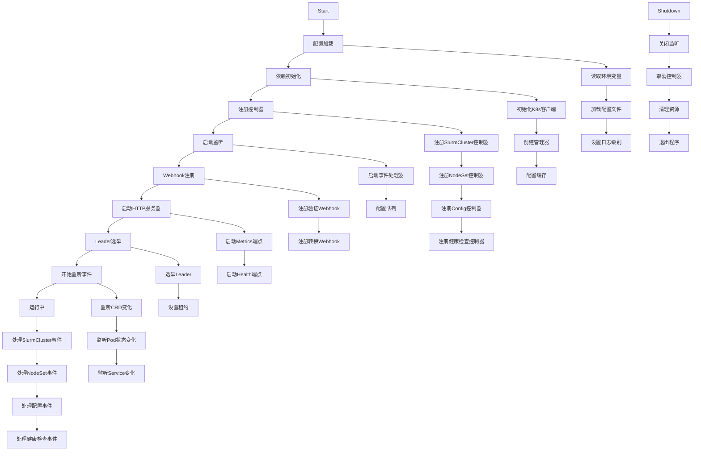
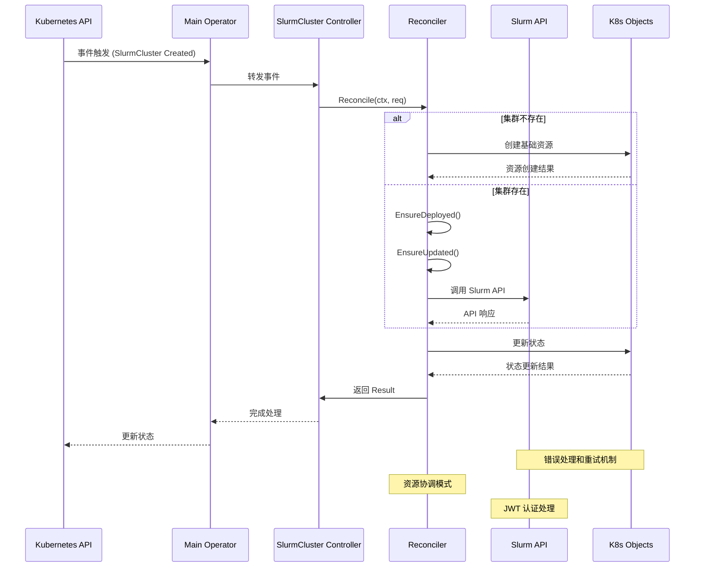
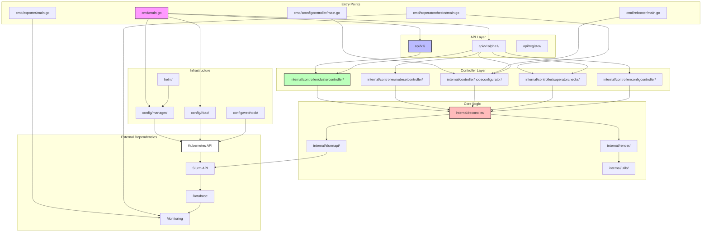

# Soperator 架构文档

## 系统整体架构综述

Soperator 是一个基于 Kubernetes 的 Slurm 集群管理器，采用了**微服务架构**和**控制器模式**。系统通过 Kubernetes 的控制器框架管理 Slurm 集群的生命周期，将传统的 Slurm 集群管理抽象为 Kubernetes 资源，实现了自动扩缩容、自愈和标准化部署。

### 核心架构特点

1. **控制器模式**：基于 Kubernetes controller-runtime 实现声明式 API 管理
2. **分层架构**：API 层 → 控制器层 → 协调器层 → 执行层
3. **模块化设计**：各组件职责明确，支持独立部署和扩展
4. **事件驱动**：通过 Kubernetes 事件机制驱动状态同步
5. **资源协调**：采用 EnsureDeployed/EnsureUpdated 模式进行资源管理

### 整体架构层级

```
┌─────────────────────────────────────────────────────────────┐
│                        K8s API Layer                        │
│  ┌─────────────┐  ┌─────────────┐  ┌─────────────┐         │
│  │  CRD API    │  │   Events    │  │   Webhooks  │         │
│  └────���────────┘  └─────────────┘  └─────────────┘         │
└─────────────────────────────────────────────────────────────┘
                              │
┌─────────────────────────────────────────────────────────────┐
│                      Controller Layer                       │
│  ┌─────────────┐  ┌─────────────┐  ┌─────────────┐         │
│  │Main Operator│  │NodeSet Ctrl │  │Config Ctrl  │         │
│  │             │  │             │  │             │         │
│  └─────────────┘  └─────────────┘  └─────────────┘         │
└─────────────────────────────────────────────────────────────┘
                              │
┌─────────────────────────────────────────────────────────────┐
│                      Reconciler Layer                      │
│  ┌─────────────┐  ┌─────────────┐  ┌─────────────┐         │
│  │  State      │  │  Resources   │  │  Slurm API  │         │
│  │ Management  │  │  Coordination│  │  Client     │         │
│  └─────────────┘  └─────────────┘  └─────────────┘         │
└─────────────────────────────────────────────────────────────┘
                              │
┌─────────────────────────────────────────────────────────────┐
│                    Execution Layer                         │
│  ┌─────────────┐  ┌─────────────┐  ┌─────────────┐         │
│  │ K8s Objects │  │  Containers │  │  Services   │         │
│  │ Deployments │  │  Pods        │  │  ConfigMaps │         │
│  └─────────────┘  └─────────────┘  └─────────────┘         │
└─────────────────────────────────────────────────────────────┘
```

## 顶层目录表

| 目录 | 作用 | 关键文件 |
|------|------|----------|
| **cmd/** | 程序入口点，包含5个可执行程序 | `main.go` - 主入口<br>`exporter/main.go` - 指标导出器<br>`soperatorchecks/main.go` - 健康检查<br>`sconfigcontroller/main.go` - 配置控制器<br>`rebooter/main.go` - 重启服务 |
| **api/** | Kubernetes API 定义，包含 CRD | `v1/slurmcluster_types.go` - 主集群资源<br>`v1alpha1/nodeconfigurator_types.go` - 节点配置<br>`v1alpha1/nodeset_types.go` - 节点分组<br>`v1alpha1/activecheck_types.go` - 健康检查 |
| **internal/** | 核心业务逻辑和内部组件 | `controller/clustercontroller/` - 集群控制器<br>`controller/reconciler/` - 资源协调器<br>`controller/soperatorchecks/` - 健康检查逻辑<br>`slurmapi/` - Slurm API 客户端<br>`render/` - 模板渲染引擎 |
| **config/** | Kubernetes 部署配置 | `manager/` - 主控制器配置<br>`rbac/` - 权限配置<br>`webhook/` - Webhook 配置<br>`crd/bases/` - CRD 定义 |
| **helm/** | Helm Chart 部署 | `soperator/` - 主操作符 Chart<br>`slurm-cluster/` - 集群 Chart<br>`soperatorchecks/` - 健康检查 Chart<br>`nodeconfigurator/` - 节点配置 Chart |
| **images/** | Docker 容器镜像定义 | `common/go-base.dockerfile` - Go 基础镜像<br>`jail/` - Jail 容器<br>`slurm-cluster/` - 集群组件镜像 |
| **docs/** | 项目文档 | `claude/` - Claude 代码助手文档<br>`design/` - 设计文档<br>`api-reference/` - API 参考 |
| **test/** | 测试相关代码 | `e2e/` - 端到端测试<br>`unit/` - 单元测试 |

## 启动流程图



## 核心调用链时序图



## 模块依赖关系图



## 外部依赖

### 1. Kubernetes 集群
- **版本要求**: Kubernetes v1.31+
- **CNI 要求**: 支持客户端源 IP 保留（推荐 Cilium 在 kube-proxy 替换模式下）
- **不支持的 CNI**: kube-proxy IPVS 模式、kube-router、Antrea Proxy
- **核心功能**: 提供 API Server、etcd、控制器管理等基础服务

### 2. Slurm 集群
- **版本**: Slurm 25.05.4
- **组件**: slurmctld（控制器）、slurmd（节点）、slurmrestd（REST API）、slurmdbd（数据库）
- **认证**: Munge 认证系统
- **配置**: 通过 Slurm 配置文件管理集群行为

### 3. 数据库系统
- **MariaDB**:
  - 版本: 11.4.3
  - 作用: 存储作业信息、集群状态、用户数据
  - 通过 Helm Chart 自动部署和管理
- **Redis**:
  - 作用: 缓存和会话管理
  - 可选部署

### 4. 存储系统
- **NFS**:
  - 作用: 共享存储，实现统一根文件系统
  - 通过 Helm Chart 自动部署
- **Persistent Volume**:
  - 作用: 持久化存储配置和数据
  - 支持多种存储后端

### 5. 监控系统
- **Prometheus**:
  - 作用: 指标收集和存储
  - 集成 soperator-exporter 提供自定义指标
- **Grafana**:
  - 作用: 数据可视化
  - 预设仪表板显示集群状态

### 6. GPU 监控
- **DCGM (Data Center GPU Manager)**:
  - 作用: GPU 监控和管理
  - 通过 soperator-dcgm-exporter 集成
  - 版本: 与 CUDA 12.9 兼容

### 7. 消息队列
- **Kubernetes Events**:
  - 作用: 事件通知和状态同步
  - 通过 Event Bus 机制处理
- **Webhook**:
  - 作用: 外部通知和集成
  - 支持自定义 Webhook 配置

### 8. 认证和授权
- **JWT Token**:
  - 作用: Slurm API 认证
  - 通过 golang-jwt/jwt/v5 实现
- **Kubernetes RBAC**:
  - 作用: 权限控制
  - 自动生成和配置

### 9. 外部 API
- **Slurm REST API**:
  - 作用: 与 Slurm 集群交互
  - 通过 slurm-client 库实现
- **Kubernetes API**:
  - 作用: 资源管理
  - 通过 client-go 库实现

### 10. CI/CD 和运维工具
- **FluxCD**:
  - 作用: GitOps 自动化部署
  - 通过 Helm Chart 集成
- **Helm**:
  - 作用: 包管理器
  - 版本: v3.18.3
- **Kustomize**:
  - 作用: 配置管理
  - 版本: v5.5.0

## 配置项

### 1. 环境变量配置

#### 主控制器环境变量
| 环境变量 | 默认值 | 说明 |
|----------|--------|------|
| `ENABLE_WEBHOOKS` | `true` | 启用或禁用 Webhook |
| `IS_PROMETHEUS_CRD_INSTALLED` | `false` | 是否安装 Prometheus CRD |
| `IS_MARIADB_CRD_INSTALLED` | `false` | 是否安装 MariaDB CRD |
| `IS_APPARMOR_CRD_INSTALLED` | `false` | 是否安装 AppArmor CRD |
| `SLURM_OPERATOR_WATCH_NAMESPACES` | `*` | 监控的命名空间，`*` 表示所有命名空间 |
| `LEADER_ELECTION` | `true` | 启用领导者选举 |
| `LEADER_ELECTION_ID` | `slurm-operator` | 领导者选举 ID |
| `OPERATOR_NAMESPACE` | `soperator-system` | 操作符命名空间 |

#### 命令行参数
```bash
# 主控制器参数
--leader-elect              # 启用领导者选举
--log-level=debug           # 日志级别
--operator-namespace=soperator-system  # 操作符命名空间
--enable-topology-controller=true      # 启用拓扑控制器

# Exporter 参数
--metrics-port=8080          # 指标端口
--health-port=8081          # 健康检查端口

# 健康检查参数
--check-interval=30s        # 检查间隔
--timeout=10s              # 超时时间
--retries=3               # 重试次数
```

### 2. Helm Chart 配置

#### 主操作符 Chart (`helm/soperator/values.yaml`)
```yaml
controllerManager:
  manager:
    image:
      repository: cr.eu-north1.nebius.cloud/soperator/slurm-operator
      tag: 1.22.1
      pullPolicy: Always

  replicas: 1
  resources:
    limits:
      memory: 128Mi
    requests:
      cpu: 100m
      memory: 64Mi

  securityContext:
    runAsNonRoot: true
    allowPrivilegeEscalation: false
    capabilities:
      drop: ["ALL"]
```

#### 集群 Chart (`helm/slurm-cluster/values.yaml`)
```yaml
# Slurm 版本配置
slurmVersion: 25.05.4
ubuntuVersion: noble

# 镜像配置
images:
  slurmctld: cr.eu-north1.nebius.cloud/soperator/controller_slurmctld
  slurmd: cr.eu-north1.nebius.cloud/soperator/worker_slurmd
  slurmdbd: cr.eu-north1.nebius.cloud/soperator/controller_slurmdbd
  sshd: cr.eu-north1.nebius.cloud/soperator/login_sshd

# 节点配置
controller:
  replicas: 1
  resources:
    limits:
      cpu: 2
      memory: 4Gi

worker:
  replicas: 2
  resources:
    limits:
      cpu: 4
      memory: 8Gi
      nvidia.com/gpu: 2  # GPU 配置
```

#### 健康检查 Chart (`helm/soperatorchecks/values.yaml`)
```yaml
checks:
  manager:
    image:
      repository: cr.eu-north1.nebius.cloud/soperator/soperatorchecks
      tag: 1.22.1
    interval: 30s
    timeout: 10s
    retries: 3

# GPU 检查配置
gpu:
  enabled: true
  dcgm:
    enabled: true
    interval: 15s
```

### 3. Kubernetes 配置

#### RBAC 权限配置
```yaml
# ClusterRole - 主控制器权限
apiVersion: rbac.authorization.k8s.io/v1
kind: ClusterRole
metadata:
  name: slurm-operator-manager-role
rules:
- apiGroups: ["slurm.nebius.ai"]
  resources: ["slurmclusters", "nodesets", "nodeconfigurators", "activechecks"]
  verbs: ["get", "list", "watch", "create", "update", "patch", "delete"]
- apiGroups: ["apps"]
  resources: ["deployments", "statefulsets", "daemonsets"]
  verbs: ["*"]
- apiGroups: [""]
  resources: ["pods", "services", "configmaps", "secrets"]
  verbs: ["*"]
```

#### Webhook 配置
```yaml
# MutatingWebhook - 配置转换
apiVersion: admissionregistration.k8s.io/v1
kind: MutatingWebhookConfiguration
webhooks:
- name: nodeconfigurator.mutating.slurm.nebius.ai
  rules:
  - apiGroups: ["slurm.nebius.ai"]
    apiVersions: ["v1alpha1"]
    operations: ["CREATE", "UPDATE"]
    resources: ["nodeconfigurators"]
```

#### 健康检查配置
```yaml
# ReadinessProbe
livenessProbe:
  httpGet:
    path: /healthz
    port: 8081
  initialDelaySeconds: 15
  periodSeconds: 20

readinessProbe:
  httpGet:
    path: /readyz
    port: 8081
  initialDelaySeconds: 5
  periodSeconds: 10
```

### 4. 存储配置

#### NFS 配置
```yaml
# NFS Server Chart 配置
nfs:
  enabled: true
  size: 100Gi
  storageClass: standard

# Persistent Volume Claims
pvc:
  enabled: true
  size: 50Gi
  storageClass: standard
```

### 5. 监控配置

#### Prometheus 配置
```yaml
# 指标配置
metrics:
  enabled: true
  serviceMonitor:
    enabled: true
    interval: 30s
    scrapeTimeout: 10s

# 自定义指标
customMetrics:
  - name: slurm_cluster_nodes_total
    type: gauge
    description: "Total number of Slurm cluster nodes"
  - name: slurm_jobs_running
    type: gauge
    description: "Number of currently running Slurm jobs"
```

### 6. 日志配置

#### 日志级别配置
```yaml
logging:
  level: "info"  # debug, info, warn, error
  format: "json"  # json, text
  outputs:
    - type: stdout
      format: json
    - type: file
      path: /var/log/soperator.log
      maxSize: 100MB
      maxAge: 30d
      maxBackups: 3
```

### 7. 安全配置

#### 安全上下文
```yaml
securityContext:
  runAsNonRoot: true
  runAsUser: 65532
  runAsGroup: 65532
  seccompProfile:
    type: RuntimeDefault
  capabilities:
    drop:
      - ALL
    add:
      - NET_BIND_SERVICE
```

#### TLS 配置
```yaml
tls:
  enabled: true
  secretName: slurm-operator-tls
  caCert: /path/to/ca.crt
  cert: /path/to/tls.crt
  key: /path/to/tls.key
```