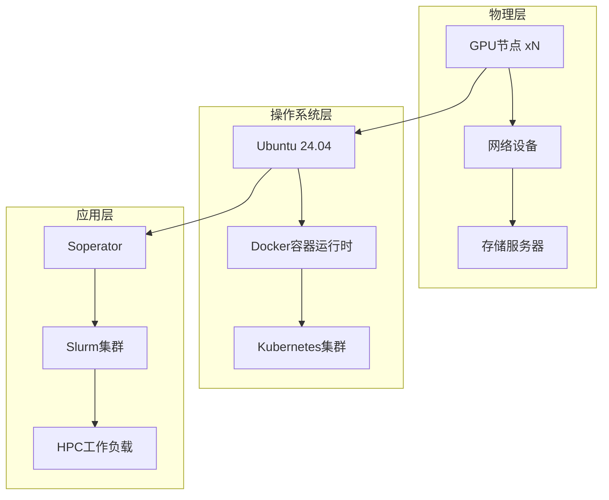
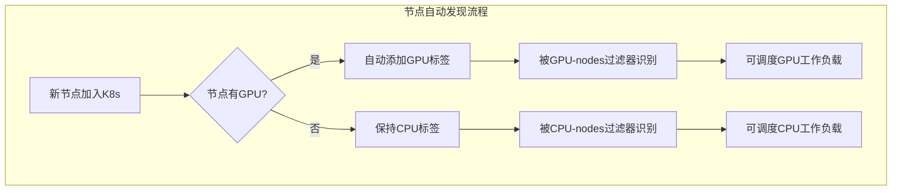
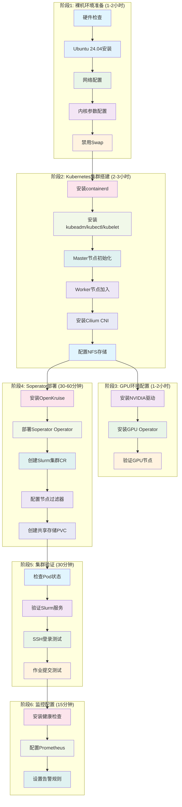

# 从裸机搭建Soperator完整流程

## 概述

本文档详细描述了从物理服务器（裸机）开始，完整搭建Soperator Kubernetes HPC集群的全过程。整个流程包括环境准备、Kubernetes集群搭建、GPU环境配置、Soperator部署、集群验证和监控配置等六个主要阶段。

### 系统架构概览



## 🖥️ 阶段1: 裸机环境准备

### 1.1 硬件要求检查

#### 基础硬件要求
- **CPU**: x86_64架构，至少4核
- **内存**: 至少8GB RAM
- **存储**: 至少100GB可用空间
- **网络**: 千兆以太网

#### GPU硬件要求（可选）
- **GPU**: NVIDIA GPU（支持CUDA 12.9）
- **显存**: 至少8GB VRAM
- **驱动**: 兼容NVIDIA驱动550.54.14+

```bash
# 检查CPU和内存信息
lscpu
free -h

# 检查GPU信息（如果有）
nvidia-smi
lspci | grep -i nvidia

# 检查网络接口
ip addr show
```

### 1.2 操作系统安装

#### 安装Ubuntu 24.04 Server
1. 下载Ubuntu 24.04 Server ISO镜像
2. 创建可启动USB设备
3. 执行最小化安装，仅包含SSH server组件
4. 配置时区和网络设置

#### 系统更新和基础工具安装
```bash
# 更新系统软件包
sudo apt update && sudo apt upgrade -y

# 安装基础工具
sudo apt install -y curl wget git htop iotop vim net-tools \
    software-properties-common apt-transport-https ca-certificates \
    gnupg lsb-release
```

### 1.3 网络配置

#### 配置静态IP地址
```bash
# 编辑网络配置文件
sudo netplan edit

# 示例配置
network:
  version: 2
  ethernets:
    ens192:
      dhcp4: no
      addresses: [192.168.1.100/24]
      gateway4: 192.168.1.1
      nameservers:
        addresses: [8.8.8.8, 8.8.4.4]

# 应用配置
sudo netplan apply
```

#### 配置hosts文件
```bash
sudo tee /etc/hosts << EOF
127.0.0.1 localhost
<master-ip> k8s-master
<worker1-ip> k8s-worker1
<worker2-ip> k8s-worker2
EOF
```

### 1.4 Kubernetes系统配置

#### 禁用Swap（Kubernetes要求）
```bash
# 立即禁用swap
sudo swapoff -a

# 永久禁用swap
sudo sed -i '/ swap / s/^\(.*\)$/#\1/g' /etc/fstab
```

#### 配置内核模块
```bash
# 加载必要的内核模块
cat <<EOF | sudo tee /etc/modules-load.d/k8s.conf
overlay
br_netfilter
EOF

sudo modprobe overlay
sudo modprobe br_netfilter
```

#### 配置内核参数
```bash
cat <<EOF | sudo tee /etc/sysctl.d/k8s.conf
net.bridge.bridge-nf-call-iptables  = 1
net.bridge.bridge-nf-call-ip6tables = 1
net.ipv4.ip_forward                 = 1
net.ipv4.conf.all.forwarding        = 1
EOF

# 立即应用内核参数
sudo sysctl --system
```

## 🔧 阶段2: Kubernetes集群搭建

### 2.1 安装容器运行时（containerd）

#### 安装containerd
```bash
# 添加Docker GPG密钥
sudo mkdir -p /etc/apt/keyrings
curl -fsSL https://download.docker.com/linux/ubuntu/gpg | sudo gpg --dearmor -o /etc/apt/keyrings/docker.gpg

# ���加Docker仓库
echo \
  "deb [arch=$(dpkg --print-architecture) signed-by=/etc/apt/keyrings/docker.gpg] https://download.docker.com/linux/ubuntu \
  $(lsb_release -cs) stable" | sudo tee /etc/apt/sources.list.d/docker.list > /dev/null

# 安装containerd
sudo apt update
sudo apt install -y containerd.io
```

#### 配置containerd
```bash
# 创建配置目录
sudo mkdir -p /etc/containerd

# 生成默认配置
sudo containerd config default | sudo tee /etc/containerd/config.toml

# 修改配置使用systemd cgroup
sudo sed -i 's/SystemdCgroup = false/SystemdCgroup = true/g' /etc/containerd/config.toml

# 启动并启用containerd服务
sudo systemctl restart containerd
sudo systemctl enable containerd
```

### 2.2 安装Kubernetes组件

#### 添加Kubernetes官方仓库
```bash
# 添加Kubernetes GPG密钥
curl -fsSL https://pkgs.k8s.io/core:/stable:/v1.31/deb/Release.key | sudo gpg --dearmor -o /etc/apt/keyrings/kubernetes-apt-keyring.gpg

# 添加Kubernetes仓库
echo 'deb [signed-by=/etc/apt/keyrings/kubernetes-apt-keyring.gpg] https://pkgs.k8s.io/core:/stable:/v1.31/deb/ /' | sudo tee /etc/apt/sources.list.d/kubernetes.list

# 更新包列表
sudo apt update
```

#### 安装kubelet、kubeadm和kubectl
```bash
# 安装Kubernetes组件
sudo apt install -y kubelet kubeadm kubectl

# 锁定版本，防止自动更新
sudo apt-mark hold kubelet kubeadm kubectl

# 启动并启用kubelet服务
sudo systemctl enable kubelet
```

### 2.3 Kubernetes集群初始化

#### Master节点初始化
```bash
# 在Master节点上执行集群初始化
sudo kubeadm init \
  --pod-network-cidr=10.244.0.0/16 \
  --apiserver-advertise-address=<master-ip> \
  --ignore-preflight-errors=all

# 配置kubectl访问权限
mkdir -p $HOME/.kube
sudo cp -i /etc/kubernetes/admin.conf $HOME/.kube/config
sudo chown $(id -u):$(id -g) $HOME/.kube/config

# 保存worker节点join命令
kubeadm token create --print-join-command > /tmp/kubeadm-join.sh
```

#### Worker节点加入集群
```bash
# 在每个Worker节点执行join命令
sudo kubeadm join <master-ip>:6443 \
  --token <token> \
  --discovery-token-ca-cert-hash <hash>

# 或使用保存的脚本
sudo bash /tmp/kubeadm-join.sh
```

#### 验证集群状态
```bash
# 检查节点状态
kubectl get nodes -o wide

# 检查系统Pod状态
kubectl get pods -n kube-system
```

### 2.4 安装CNI网络插件

#### 安装Cilium（推荐）
```bash
# 下载Cilium CLI
CILIUM_CLI_VERSION=$(curl -s https://raw.githubusercontent.com/cilium/cilium-cli/master/stable.txt)
curl -L --fail --remote-name-all https://github.com/cilium/cilium-cli/releases/download/${CILIUM_CLI_VERSION}/cilium-linux-amd64.tar.gz{,.sha256sum}

# 验证下载文件
sha256sum --check cilium-linux-amd64.tar.gz.sha256sum

# 解压并安装
sudo tar xzvfC cilium-linux-amd64.tar.gz /usr/local/bin
rm cilium-linux-amd64.tar.gz{,.sha256sum}

# 安装Cilium（启用kube-proxy替换模式）
cilium install --set kubeProxyReplacement=strict

# 验证Cilium安装
cilium status
kubectl get pods -n kube-system | grep cilium
```

#### 测试网络连通性
```bash
# 安装网络连通性测试工具
cilium connectivity test

# 检查Cilium配置
cilium config view
```

### 2.5 配置共享存储

#### 安装NFS服务器
```bash
# 在Master节点安装NFS服务器
sudo apt install -y nfs-kernel-server

# 创建共享目录
sudo mkdir -p /export/slurm
sudo chown nobody:nogroup /export/slurm
sudo chmod 777 /export/slurm

# 配置NFS导出
echo '/export/slurm *(rw,fsid=0,async,no_subtree_check,no_auth_nlm,insecure,no_root_squash)' | sudo tee -a /etc/exports

# 更新NFS导出并重启服务
sudo exportfs -a
sudo systemctl restart nfs-kernel-server
sudo systemctl enable nfs-kernel-server

# 验证NFS服务
sudo exportfs -v
```

#### 安装NFS CSI驱动
```bash
# 添加NFS CSI Helm仓库
helm repo add csi-driver-nfs https://raw.githubusercontent.com/kubernetes-csi/csi-driver-nfs/master/charts
helm repo update

# 安装NFS CSI驱动
helm install csi-driver-nfs csi-driver-nfs/csi-driver-nfs --namespace kube-system

# 验证CSI驱动安装
kubectl get pods -n kube-system | grep nfs
```

#### 创建StorageClass
```bash
# 创建NFS StorageClass
kubectl apply -f - <<EOF
apiVersion: storage.k8s.io/v1
kind: StorageClass
metadata:
  name: nfs-csi
provisioner: nfs.csi.k8s.io
parameters:
  server: $(hostname -I | awk '{print $1}')
  share: /export/slurm
reclaimPolicy: Retain
volumeBindingMode: Immediate
EOF

# 验证StorageClass创建
kubectl get storageclass
```

## 🚀 阶段3: GPU环境配置（可选）

### 3.1 安装NVIDIA驱动

#### 在GPU节点安装驱动
```bash
# 安装必要的编译工具
sudo apt install -y build-essential dkms

# 下载CUDA安装包（包含驱动）
wget https://developer.download.nvidia.com/compute/cuda/12.9.0/local_installers/cuda_12.9.0_550.54.14_linux.run

# 安装驱动（仅安装驱动，不安装CUDA工具包）
sudo sh cuda_12.9.0_550.54.14_linux.run --silent --driver

# 重启系统以加载驱动
sudo reboot
```

#### 验证驱动安装
```bash
# 检查GPU状态
nvidia-smi

# 检查GPU设备
lspci | grep -i nvidia

# 查看驱动模块
lsmod | grep nvidia
```

### 3.2 安装NVIDIA GPU Operator

#### 添加NVIDIA Helm仓库
```bash
# 添加NVIDIA Helm仓库
helm repo add nvidia https://nvidia.github.io/gpu-operator
helm repo update
```

#### 安装GPU Operator
```bash
# 创建GPU命名空间
kubectl create namespace gpu-operator

# 安装GPU Operator
helm install gpu-operator nvidia/gpu-operator \
  --namespace gpu-operator \
  --set driver.enabled=false \
  --set toolkit.enabled=true \
  --set devicePlugin.enabled=true \
  --set migManager.enabled=false \
  --set mig.strategy=single

# 验证GPU Operator安装
kubectl get pods -n gpu-operator
kubectl get nodes -o wide
```

#### 验证GPU节点
```bash
# 检查节点GPU标签
kubectl describe nodes | grep -i gpu

# 检查GPU设备插件
kubectl logs -n gpu-operator -l app.kubernetes.io/component=nvidia-device-plugin-daemonset
```

## 📦 阶段4: Soperator部署

### 4.1 安装前置依赖

#### 安装OpenKruise Operator
```bash
# 添加OpenKruise Helm仓库
helm repo add openkruise https://openkruise.github.io/charts
helm repo update

# 安装OpenKruise Operator
helm install kruise openkruise/kruise --namespace kruise-system --create-namespace

# 验证OpenKruise安装
kubectl get pods -n kruise-system
kubectl get crd | grep kruise
```

#### 安装可选依赖组件

##### 安装Prometheus CRDs（用于监控）
```bash
# 安装Prometheus Operator CRDs
kubectl apply -f https://github.com/prometheus-operator/prometheus-operator/releases/download/v0.68.0/bundle.yaml

# 验证Prometheus CRDs
kubectl get crd | grep monitoring
```

##### 安装AppArmor CRDs（用于安全）
```bash
# 安装AppArmor Operator
kubectl apply -f https://raw.githubusercontent.com/kubernetes-sigs/apparmor-operator/main/config/crd/bases/apparmorsecurityprofiles.kubernetes.io_profiles.yaml

# 验证AppArmor CRDs
kubectl get crd | grep apparmor
```

### 4.2 部署Soperator Operator

#### 创建Soperator命名空间
```bash
# 创建Soperator系统命名空间
kubectl create namespace soperator-system
```

#### 添加Soperator Helm仓库
```bash
# 添加Soperator官方仓库
helm repo add soperator https://nebius.github.io/soperator
helm repo update

# 查看可用版本
helm search repo soperator
```

#### 部署Soperator
```bash
# 部署稳定版本
helm install soperator soperator/soperator \
  --namespace soperator-system \
  --set logLevel=info \
  --set enableWebhooks=true \
  --set enableTopologyController=true

# 验证Soperator安装
kubectl get pods -n soperator-system
kubectl get crd | grep slurm

# 查看Soperator日志
kubectl logs -n soperator-system -l app.kubernetes.io/name=soperator
```

#### 检查Soperator状态
```bash
# 检查Controller Manager状态
kubectl get deployment soperator-controller-manager -n soperator-system

# 检查Webhook服务（如果启用）
kubectl get mutatingwebhookconfigurations | grep soperator
kubectl get validatingwebhookconfigurations | grep soperator
```

### 4.3 创建Slurm集群配置

#### 创建CPU集群
```bash
# 创建CPU集群命名空间
kubectl create namespace cpu-cluster

# 部署CPU Slurm集群
helm install my-cpu-cluster soperator/slurm-cluster \
  --namespace cpu-cluster \
  --set clusterName=my-cpu-cluster \
  --set clusterType=cpu \
  --set slurmNodes.worker.size=2 \
  --set slurmNodes.controller.size=1 \
  --set slurmNodes.login.size=1 \
  --set volumeSources[0].name=jail \
  --set volumeSources[0].createPVC=true \
  --set volumeSources[0].storageClassName=nfs-csi \
  --set volumeSources[0].size=20Gi

# 检查CPU集群状态
kubectl get slurmclusters -n cpu-cluster
kubectl describe slurmcluster my-cpu-cluster -n cpu-cluster
```

#### 创建GPU集群
```bash
# 创建GPU集群命名空间
kubectl create namespace gpu-cluster

# 部署GPU Slurm集群
helm install my-gpu-cluster soperator/slurm-cluster \
  --namespace gpu-cluster \
  --set clusterName=my-gpu-cluster \
  --set clusterType=gpu \
  --set slurmNodes.worker.size=4 \
  --set slurmNodes.controller.size=1 \
  --set slurmNodes.login.size=1 \
  --set volumeSources[0].name=jail \
  --set volumeSources[0].createPVC=true \
  --set volumeSources[0].storageClassName=nfs-csi \
  --set volumeSources[0].size=50Gi

# 检查GPU集群状态
kubectl get slurmclusters -n gpu-cluster
kubectl describe slurmcluster my-gpu-cluster -n gpu-cluster
```

### 4.4 配置节点过滤器

**重要说明**: 节点过滤器**只需要配置一次**，后续加入的新节点会自动被识别和使用，无需手动干预。

#### 节点过滤器工作原理

节点过滤器通过**标签选择器**和**亲和性规则**自动工作，实现"零配置"节点管理：



#### 方式A: 使用GPU Operator自动标签（推荐）

GPU Operator安装后会自动为GPU节点添加标签：
```bash
# 检查GPU Operator自动添加的标签
kubectl get nodes --show-labels | grep gpu
# 预期输出:
# node-gpu-1   accelerator=nvidia-tesla-v100,nvidia.com/gpu.present=true
# node-gpu-2   accelerator=nvidia-tesla-v100,nvidia.com/gpu.present=true
```

#### 方式B: 手动添加节点标签（一次性操作）

如果GPU Operator没有自动添加标签，可以手动添加：
```bash
# 为GPU节点添加标签（一次性操作）
kubectl label node <gpu-node-1> accelerator=nvidia-gpu node-type=gpu
kubectl label node <gpu-node-2> accelerator=nvidia-gpu node-type=gpu

# 为CPU节点添加标签
kubectl label node <cpu-node-1> node-type=cpu
kubectl label node <cpu-node-2> node-type=cpu
```

#### 为GPU集群配置节点亲和性

```bash
# 编辑GPU集群配置
kubectl edit slurmcluster my-gpu-cluster -n gpu-cluster
```

在配置中添加以下内容：
```yaml
spec:
  k8sNodeFilters:
    - name: gpu-compute-nodes
      affinity:
        nodeAffinity:
          requiredDuringSchedulingIgnoredDuringExecution:
            nodeSelectorTerms:
              # 规则1: 基于NVIDIA驱动标签（推荐）
              - matchExpressions:
                  - key: "nvidia.com/gpu.present"
                    operator: In
                    values: ["true"]
              # 规则2: 基于云提供商标签
              - matchExpressions:
                  - key: "node.kubernetes.io/instance-family"
                    operator: In
                    values: ["p3", "p4", "g4", "g5"]
              # 规则3: 通用GPU检测
              - matchExpressions:
                  - key: "accelerator"
                    operator: Exists
  slurmNodes:
    worker:
      k8sNodeFilter: gpu-compute-nodes
      size: 4
      resources:
        requests:
          nvidia.com/gpu: "1"
        limits:
          nvidia.com/gpu: "1"
    controller:
      k8sNodeFilter: gpu-compute-nodes
      size: 1
    login:
      k8sNodeFilter: gpu-compute-nodes
      size: 1
```

#### 为CPU集群配置节点亲和性

```bash
# 编辑CPU集群配置
kubectl edit slurmcluster my-cpu-cluster -n cpu-cluster
```

在配置中添加以下内容：
```yaml
spec:
  k8sNodeFilters:
    - name: cpu-compute-nodes
      affinity:
        nodeAffinity:
          requiredDuringSchedulingIgnoredDuringExecution:
            nodeSelectorTerms:
              # 规则1: 排除GPU节点
              - matchExpressions:
                  - key: "nvidia.com/gpu.present"
                    operator: DoesNotExist
              # 规则2: 排除GPU实例类型
              - matchExpressions:
                  - key: "node.kubernetes.io/instance-family"
                    operator: NotIn
                    values: ["p3", "p4", "g4", "g5"]
              # 规则3: 排除所有GPU相关标签
              - matchExpressions:
                  - key: "accelerator"
                    operator: DoesNotExist
  slurmNodes:
    worker:
      k8sNodeFilter: cpu-compute-nodes
      size: 2
      resources:
        requests:
          cpu: "2"
          memory: "4Gi"
        limits:
          cpu: "4"
          memory: "8Gi"
    controller:
      k8sNodeFilter: cpu-compute-nodes
      size: 1
    login:
      k8sNodeFilter: cpu-compute-nodes
      size: 1
```

#### 验证节点过滤器配置

```bash
# 1. 查看所有节点和标签
kubectl get nodes --show-labels

# 2. 检查哪些节点被GPU过滤器识别
kubectl get nodes -l nvidia.com/gpu.present=true

# 3. 检查哪些节点被CPU过滤器识别
kubectl get nodes -l '!nvidia.com/gpu.present'

# 4. 查看Slurm集群实际使用的节点
kubectl get pods -n gpu-cluster -o wide
kubectl get pods -n cpu-cluster -o wide
```

#### 动态扩容示例

添加新节点后，无需修改节点过滤器配置：

```bash
# 1. 新GPU节点自动加入后，GPU Operator会自动添加标签
# 2. 验证新节点被识别
kubectl get nodes --show-labels | grep new-gpu-node

# 3. 直接扩容Slurm集群，无需修改过滤器
kubectl patch slurmcluster my-gpu-cluster -n gpu-cluster \
  --type='merge' \
  -p='{"spec":{"slurmNodes":{"worker":{"size":6}}}}'  # 从4扩到6

# 4. 验证新Pod调度到新节点
kubectl get pods -n gpu-cluster -o wide --sort-by=.spec.nodeName
```

#### 自动化节点标签脚本

创建自动标签脚本 `auto-label-nodes.sh`：
```bash
#!/bin/bash
# auto-label-nodes.sh - 自动为新节点添加标签

echo "开始自动标签节点..."

# 检测GPU节点并添加标签
for node in $(kubectl get nodes -o name); do
    node_name=$(echo $node | cut -d'/' -f2)

    # 检查节点是否有GPU设备
    if kubectl describe node $node_name | grep -q "nvidia.com/gpu"; then
        echo "发现GPU节点: $node_name"
        kubectl label node $node_name node-type=gpu --overwrite
        kubectl label node $node_name nvidia.com/gpu.present=true --overwrite
    else
        echo "发现CPU节点: $node_name"
        kubectl label node $node_name node-type=cpu --overwrite
    fi
done

echo "节点标签更新完成"
kubectl get nodes --show-labels
```

#### 最佳实践建议

1. **使用GPU Operator自动标签**: 最可靠的方式，无需人工干预
2. **多规则备份**: 配置多个匹配规则，提高识别成功率
3. **定期验证**: 定期检查节点过滤器是否正确识别新节点
4. **监控调度**: 监控Pod是否调度到正确的节点类型
5. **日志检查**: 定期查看Soperator日志，排查调度问题

**关键优势**: 节点过滤器配置一次后，后续所有新节点都会自动被正确分类和使用，实现真正的"零运维"节点管理。

### 4.5 验证PVC创建
```bash
# 检查PVC状态
kubectl get pvc -n cpu-cluster
kubectl get pvc -n gpu-cluster

# 检查存储使用情况
kubectl describe pvc jail -n gpu-cluster
```

## 🎯 阶段5: 集群验证和测试

### 5.1 集群状态检查

#### 检查Slurm集群状态
```bash
# 查看所有Slurm集群
kubectl get slurmclusters -A

# 查看集群详细状态
kubectl describe slurmcluster my-gpu-cluster -n gpu-cluster
kubectl describe slurmcluster my-cpu-cluster -n cpu-cluster

# 检查集群条件
kubectl get slurmcluster my-gpu-cluster -n gpu-cluster -o jsonpath='{.status.conditions}'
```

#### 检查Pod状态
```bash
# 查看GPU集群Pod状态
kubectl get pods -n gpu-cluster
kubectl get pods -n gpu-cluster -o wide

# 查看CPU集群Pod状态
kubectl get pods -n cpu-cluster
kubectl get pods -n cpu-cluster -o wide

# 检查Pod重启情况
kubectl get pods -n gpu-cluster --sort-by='.status.containerStatuses[0].restartCount'
```

#### 查看集群事件
```bash
# 查看GPU集群事件
kubectl get events -n gpu-cluster --sort-by='.lastTimestamp'

# 查看CPU集群事件
kubectl get events -n cpu-cluster --sort-by='.lastTimestamp'

# 查看Soperator事件
kubectl get events -n soperator-system --sort-by='.lastTimestamp'
```

### 5.2 等待集群就绪

#### 等待集群变为Available状态
```bash
# 等待GPU集群就绪
kubectl wait --for=condition=Available slurmcluster/my-gpu-cluster -n gpu-cluster --timeout=20m

# 等待CPU集群就绪
kubectl wait --for=condition=Available slurmcluster/my-cpu-cluster -n cpu-cluster --timeout=20m

# 检查集群状态
kubectl get slurmclusters -A -o wide
```

#### 验证Slurm服务状态
```bash
# 检查GPU集群Slurm状态
kubectl exec -it login-0 -n gpu-cluster -- sinfo
kubectl exec -it login-0 -n gpu-cluster -- scontrol show daemons

# 检查CPU集群Slurm状态
kubectl exec -it login-0 -n cpu-cluster -- sinfo
kubectl exec -it login-0 -n cpu-cluster -- scontrol show daemons
```

### 5.3 SSH登录测试

#### 设置SSH端口转发
```bash
# 转发GPU集群SSH端口
kubectl port-forward -n gpu-cluster svc/login 30022:22 &

# 转发CPU集群SSH端口
kubectl port-forward -n cpu-cluster svc/login 30023:22 &
```

#### SSH登录测试
```bash
# 测试GPU集群登录
ssh -p 30022 soperator@localhost

# 测试CPU集群登录
ssh -p 30023 soperator@localhost
```

在Slurm节点内执行：
```bash
# 检查节点状态
sinfo

# 检查用户环境
whoami
pwd
ls -la

# 检查共享文件系统
df -h
```

### 5.4 作业提交测试

#### 创建测试作业脚本
```bash
# 在GPU集群创建测试作业
kubectl exec -it login-0 -n gpu-cluster -- bash -c 'cat > gpu_test_job.sh << EOF
#!/bin/bash
#SBATCH --ntasks=2
#SBATCH --gres=gpu:1
#SBATCH --time=00:05:00
#SBATCH --output=gpu_test_%j.out
#SBATCH --error=gpu_test_%j.err

echo "Job started at: \$(date)"
echo "Running on node: \$(hostname)"
echo "Job ID: \$SLURM_JOB_ID"

# 检查GPU状态
nvidia-smi

# 运行简单的GPU计算
python3 -c "
import torch
if torch.cuda.is_available():
    print(f'CUDA available: {torch.cuda.is_available()}')
    print(f'GPU count: {torch.cuda.device_count()}')
    print(f'Current device: {torch.cuda.current_device()}')
    print(f'Device name: {torch.cuda.get_device_name(0)}')

    # 简单矩阵乘法测试
    a = torch.randn(1000, 1000).cuda()
    b = torch.randn(1000, 1000).cuda()
    c = torch.matmul(a, b)
    print(f'Matrix multiplication completed: {c.shape}')
else:
    print('CUDA not available')
"

echo "Job completed at: \$(date)"
EOF'

# 在CPU集群创建测试作业
kubectl exec -it login-0 -n cpu-cluster -- bash -c 'cat > cpu_test_job.sh << EOF
#!/bin/bash
#SBATCH --ntasks=2
#SBATCH --cpus-per-task=2
#SBATCH --time=00:05:00
#SBATCH --output=cpu_test_%j.out
#SBATCH --error=cpu_test_%j.err

echo "Job started at: \$(date)"
echo "Running on node: \$(hostname)"
echo "Job ID: \$SLURM_JOB_ID"

# 运行简单的CPU计算
echo "Performing CPU intensive computation..."
for i in {1..10}; do
    echo "Iteration \$i: \$(date)"
    sleep 1
done

# 简单的矩阵计算（使用Python）
python3 -c "
import numpy as np
print('NumPy available:', np.__version__)

# 简单矩阵乘法测试
a = np.random.rand(1000, 1000)
b = np.random.rand(1000, 1000)
c = np.dot(a, b)
print(f'NumPy matrix multiplication completed: {c.shape}')

# 计算Pi值
n = 1000000
x = np.random.rand(n)
y = np.random.rand(n)
inside = (x**2 + y**2) <= 1
pi_estimate = 4 * np.sum(inside) / n
print(f'Pi estimate: {pi_estimate}')
"

echo "Job completed at: \$(date)"
EOF'
```

#### 提交测试作业
```bash
# 提交GPU测试作业
kubectl exec -it login-0 -n gpu-cluster -- sbatch gpu_test_job.sh

# 提交CPU测试作业
kubectl exec -it login-0 -n cpu-cluster -- sbatch cpu_test_job.sh
```

#### 监控作业执行
```bash
# 监控GPU集群作业
kubectl exec -it login-0 -n gpu-cluster -- squeue
kubectl exec -it login-0 -n gpu-cluster -- squeue -u soperator

# 监控CPU集群作业
kubectl exec -it login-0 -n cpu-cluster -- squeue
kubectl exec -it login-0 -n cpu-cluster -- squeue -u soperator

# 查看作业详情
kubectl exec -it login-0 -n gpu-cluster -- scontrol show job <job_id>
kubectl exec -it login-0 -n cpu-cluster -- scontrol show job <job_id>
```

#### 查看作业输出
```bash
# 查看GPU作业输出
kubectl exec -it login-0 -n gpu-cluster -- cat gpu_test_*.out
kubectl exec -it login-0 -n gpu-cluster -- cat gpu_test_*.err

# 查看CPU作业输出
kubectl exec -it login-0 -n cpu-cluster -- cat cpu_test_*.out
kubectl exec -it login-0 -n cpu-cluster -- cat cpu_test_*.err
```

## 🔍 阶段6: 监控和运维配置

### 6.1 安装健康检查组件

#### 部署ActiveChecks
```bash
# 为GPU集群安装健康检查
helm install my-gpu-cluster-checks soperator/soperator-activechecks \
  --namespace gpu-cluster \
  --set clusterName=my-gpu-cluster \
  --set schedule="0 */6 * * *" \
  --set checkType=slurmJob

# 为CPU集群安装健康检查
helm install my-cpu-cluster-checks soperator/soperator-activechecks \
  --namespace cpu-cluster \
  --set clusterName=my-cpu-cluster \
  --set schedule="0 */4 * * *" \
  --set checkType=slurmJob
```

#### 查看健康检查状态
```bash
# 检查ActiveCheck状态
kubectl get activechecks -n gpu-cluster
kubectl get activechecks -n cpu-cluster

# 查看健康检查日志
kubectl logs -n gpu-cluster -l app.kubernetes.io/name=soperator-activechecks
kubectl logs -n cpu-cluster -l app.kubernetes.io/name=soperator-activechecks
```

### 6.2 配置Prometheus监控

#### 配置指标导出
```bash
# 查看指标导出服务
kubectl get svc -n gpu-cluster | grep exporter
kubectl get svc -n cpu-cluster | grep exporter

# 转发指标端口
kubectl port-forward -n gpu-cluster svc/my-gpu-cluster-soperator-exporter 8080:8080 &
kubectl port-forward -n cpu-cluster svc/my-cpu-cluster-soperator-exporter 8081:8080 &
```

#### 查看Prometheus指标
```bash
# 查看GPU集群指标
curl http://localhost:8080/metrics | grep slurm

# 查看CPU集群指标
curl http://localhost:8081/metrics | grep slurm

# 查看系统指标
curl http://localhost:8080/metrics | grep kube
```

### 6.3 配置日志收集

#### 查看应用日志
```bash
# 查看Slurm控制器日志
kubectl logs -n gpu-cluster -l app.kubernetes.io/component=controller
kubectl logs -n cpu-cluster -l app.kubernetes.io/component=controller

# 查看Slurm worker日志
kubectl logs -n gpu-cluster -l app.kubernetes.io/component=worker
kubectl logs -n cpu-cluster -l app.kubernetes.io/component=worker

# 查看Soperator日志
kubectl logs -n soperator-system -l app.kubernetes.io/name=soperator
```

#### 查看系统事件
```bash
# 查看最近的集群事件
kubectl get events -n gpu-cluster --sort-by='.lastTimestamp' | tail -20
kubectl get events -n cpu-cluster --sort-by='.lastTimestamp' | tail -20

# 查看警告事件
kubectl get events --all-namespaces --field-selector type=Warning
```

## 📊 完整部署流程图



## 🎯 关键配置文件示例

### 节点过滤器配置示例

#### GPU节点过滤器
```yaml
# gpu-node-filter.yaml
apiVersion: slurm.nebius.ai/v1
kind: SlurmCluster
metadata:
  name: gpu-cluster
  namespace: gpu-cluster
spec:
  k8sNodeFilters:
    - name: gpu-nodes
      affinity:
        nodeAffinity:
          requiredDuringSchedulingIgnoredDuringExecution:
            nodeSelectorTerms:
              - matchExpressions:
                  - key: accelerator
                    operator: Exists
                  - key: nvidia.com/gpu.present
                    operator: In
                    values: ["true"]
                  - key: node.kubernetes.io/instance-type
                    operator: In
                    values: ["gpu-enabled"]
  slurmNodes:
    worker:
      k8sNodeFilter: gpu-nodes
      size: 4
      resources:
        requests:
          nvidia.com/gpu: "1"
        limits:
          nvidia.com/gpu: "1"
    controller:
      k8sNodeFilter: gpu-nodes
      size: 1
    login:
      k8sNodeFilter: gpu-nodes
      size: 1
```

#### CPU节点过滤器
```yaml
# cpu-node-filter.yaml
apiVersion: slurm.nebius.ai/v1
kind: SlurmCluster
metadata:
  name: cpu-cluster
  namespace: cpu-cluster
spec:
  k8sNodeFilters:
    - name: cpu-nodes
      affinity:
        nodeAffinity:
          requiredDuringSchedulingIgnoredDuringExecution:
            nodeSelectorTerms:
              - matchExpressions:
                  - key: accelerator
                    operator: DoesNotExist
                  - key: node.kubernetes.io/instance-type
                    operator: NotIn
                    values: ["gpu-enabled"]
  slurmNodes:
    worker:
      k8sNodeFilter: cpu-nodes
      size: 2
      resources:
        requests:
          cpu: "2"
          memory: "4Gi"
        limits:
          cpu: "4"
          memory: "8Gi"
    controller:
      k8sNodeFilter: cpu-nodes
      size: 1
    login:
      k8sNodeFilter: cpu-nodes
      size: 1
```

### 存储配置示例

#### NFS PersistentVolume
```yaml
# nfs-pv.yaml
apiVersion: v1
kind: PersistentVolume
metadata:
  name: nfs-pv-slurm
  namespace: gpu-cluster
spec:
  capacity:
    storage: 100Gi
  accessModes:
    - ReadWriteMany
  persistentVolumeReclaimPolicy: Retain
  storageClassName: nfs-csi
  nfs:
    server: <nfs-server-ip>
    path: /export/slurm
```

#### PersistentVolumeClaim
```yaml
# jail-pvc.yaml
apiVersion: v1
kind: PersistentVolumeClaim
metadata:
  name: jail-pvc
  namespace: gpu-cluster
spec:
  accessModes:
    - ReadWriteMany
  storageClassName: nfs-csi
  resources:
    requests:
      storage: 100Gi
```

## ⚠️ 常见问题和解决方案

### 网络问题排查

#### Cilium网络问题
```bash
# 检查Cilium状态
cilium status

# 检查Cilium Pod状态
kubectl get pods -n kube-system | grep cilium

# 检查Cilium配置
cilium config view

# 运行网络连通性测试
cilium connectivity test

# 查看Cilium日志
kubectl logs -n kube-system -l k8s-app=cilium
```

#### Pod间通信问题
```bash
# 测试Pod间网络连通性
kubectl run test-pod-1 --image=busybox --rm -it -- /bin/sh
# 在Pod内执行:
# nslookup kubernetes.default.svc.cluster.local
# ping 10.244.1.1

# 检查NetworkPolicy
kubectl get networkpolicy -A
```

### 存储问题排查

#### NFS连接问题
```bash
# 检查NFS服务器状态
sudo systemctl status nfs-kernel-server

# 检查NFS导出配置
sudo exportfs -v

# 测试NFS挂载
sudo mkdir -p /tmp/nfs-test
sudo mount -t nfs <nfs-server-ip>:/export/slurm /tmp/nfs-test
ls -la /tmp/nfs-test
sudo umount /tmp/nfs-test
```

#### PVC问题排查
```bash
# 检查PVC状态
kubectl get pvc -A

# 检查PVC详情
kubectl describe pvc jail-pvc -n gpu-cluster

# 检查StorageClass状态
kubectl get storageclass
kubectl describe storageclass nfs-csi
```

### GPU问题排查

#### GPU设备检测问题
```bash
# 检查节点GPU标签
kubectl describe nodes | grep -i gpu

# 检查NVIDIA驱动状态
kubectl logs -n gpu-operator -l app.kubernetes.io/component=nvidia-device-plugin-daemonset

# 在GPU节点检查驱动
ssh <gpu-node>
nvidia-smi
lsmod | grep nvidia
```

#### GPU Pod调度问题
```bash
# 检查GPU Pod调度失败原因
kubectl describe pod <gpu-pod-name> -n gpu-cluster

# 检查GPU资源配额
kubectl describe nodes | grep -A 10 "Allocated resources"
```

### 集群问题排查

#### Pod启动失败
```bash
# 查看Pod详细状态
kubectl describe pod <pod-name> -n <namespace>

# 查看Pod日志
kubectl logs <pod-name> -n <namespace>
kubectl logs <pod-name> -n <namespace> --previous

# 进入Pod调试
kubectl exec -it <pod-name> -n <namespace> -- bash
```

#### 集群状态异常
```bash
# 检查Slurm集群状态
kubectl get slurmclusters -A
kubectl describe slurmcluster <cluster-name> -n <namespace>

# 检查Soperator日志
kubectl logs -n soperator-system -l app.kubernetes.io/name=soperator

# 重启Soperator组件
kubectl delete pod -n soperator-system -l app.kubernetes.io/name=soperator
```

## 📈 部署时间估算

### 各阶段时间预估

| 阶段 | 描述 | 预估时间 | 备注 |
|------|------|----------|------|
| 1 | 裸机环境准备 | 1-2小时 | 取决于硬件和网络配置 |
| 2 | Kubernetes集群搭建 | 2-3小时 | 包括网络和存储配置 |
| 3 | GPU环境配置 | 1-2小时 | 仅GPU集群需要 |
| 4 | Soperator部署 | 30-60分钟 | 包括前置依赖 |
| 5 | 集群验证和测试 | 30分钟 | 功能验证 |
| 6 | 监控配置 | 15分钟 | 健康检查和指标 |

### 总时间预估

- **CPU集群**: 5-8小时
- **GPU集群**: 6-10小时

### 影响部署时间的因素

- **网络带宽**: 镜像下载速度
- **硬件性能**: 编译和安装速度
- **网络延迟**: 集群节点间通信
- **配置复杂度**: 自定义配置数量
- **故障排查**: 问题定位和解决时间

## 🔧 运维常用命令

### 集群管理命令

#### Kubernetes基础操作
```bash
# 查看节点状态
kubectl get nodes -o wide

# 查看集群资源使用
kubectl top nodes
kubectl top pods -n <namespace>

# 查看集群事件
kubectl get events -A --sort-by='.lastTimestamp'

# 查看系统资源
kubectl describe nodes
```

#### Slurm集群操作
```bash
# 查看Slurm集群状态
kubectl get slurmclusters -A

# 编辑集群配置
kubectl edit slurmcluster <cluster-name> -n <namespace>

# 扩容集群
kubectl patch slurmcluster <cluster-name> -n <namespace> \
  --type='merge' \
  -p='{"spec":{"slurmNodes":{"worker":{"size":<new-size>}}}}'

# 查看集群状态详情
kubectl describe slurmcluster <cluster-name> -n <namespace>
```

#### Pod管理
```bash
# 查看Pod状态
kubectl get pods -n <namespace> -o wide

# 重启Pod
kubectl delete pod <pod-name> -n <namespace>

# 查看Pod日志
kubectl logs <pod-name> -n <namespace> -f

# 进入Pod
kubectl exec -it <pod-name> -n <namespace> -- bash
```

### 监控和调试

#### 系统监控
```bash
# 查看资源使用
kubectl top nodes
kubectl top pods -n <namespace>

# 查看集群健康状态
kubectl get componentstatuses
kubectl get cs  # 简化版本

# 查看集群信息
kubectl cluster-info
kubectl version
```

#### 网络调试
```bash
# 检查Cilium状态
cilium status

# 测试网络连通性
cilium connectivity test

# 查看网络策略
kubectl get networkpolicy -A
```

#### 存储操作
```bash
# 查看存储使用
kubectl get pv,pvc -A

# 查看StorageClass
kubectl get storageclass

# 查看存储详情
kubectl describe pvc <pvc-name> -n <namespace>
```

## 📚 相关文档和资源

### 官方文档

- [Soperator GitHub Repository](https://github.com/nebius/soperator)
- [Kubernetes官方文档](https://kubernetes.io/docs/)
- [Cilium官方文档](https://docs.cilium.io/)
- [NVIDIA GPU Operator文档](https://docs.nvidia.com/datacenter/cloud-native/gpu-operator/)

### 配置文件位置

- Helm Charts: `/helm/` 目录
- API定义: `/api/v1/` 和 `/api/v1alpha1/`
- 控制器代码: `/internal/controller/`
- 配置模板: `/internal/render/`

### 支持和社区

- GitHub Issues: [Soperator Issues](https://github.com/nebius/soperator/issues)
- Slack频道: （如有）
- 邮件列表: （如有）

---

*本文档详细记录了从裸机环境开始完整部署Soperator的全过程，涵盖了从基础环境准备到生产环境运行的各个环节。如有问题或建议，请参考相关官方文档或提交Issue。*