# Soperator用户透明机制详解

## 概述

Soperator通过创新的架构设计，实现了传统Slurm HPC系统在Kubernetes上的完全容器化，同时保持了用户使用习惯的完全透明性。用户在使用Soperator时，感觉不到底层Kubernetes的存在，就像在使用传统的物理Slurm集群一样。

## 🎯 核心设计理念

### 三层抽象架构

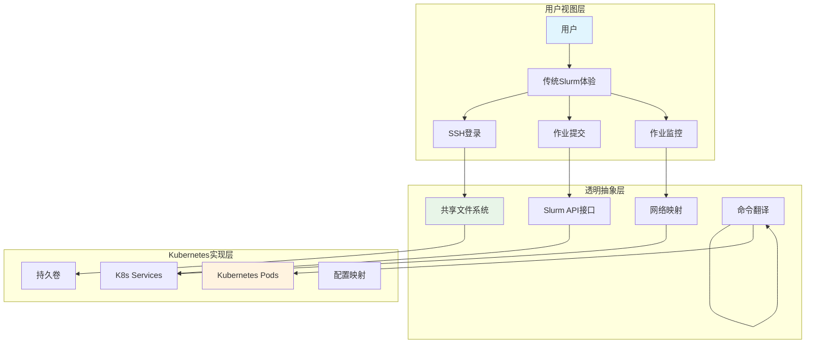

## 🔄 用户视角 vs 底层实现对比

### 用户操作流程（完全透明）
```bash
# 1. 用户SSH登录（与传统Slurm相同）
ssh soperator@login-node-ip

# 2. 准备作业脚本（与传统Slurm相同）
cat > my_job.sh << EOF
#!/bin/bash
#SBATCH --ntasks=4
#SBATCH --time=01:00:00
#SBATCH --output=job_%j.out
./my_hpc_application
EOF

# 3. 提交作业（与传统Slurm相同）
sbatch my_job.sh

# 4. 查看作业状态（与传统Slurm相同）
squeue
scontrol show job <job_id>

# 5. 查看结果（与传统Slurm相同）
cat job_12345.out
```

### 底层Kubernetes实现（完全隐藏）
```bash
# 用户看不到的底层操作：
# 1. SSH连接实际连接到Login Pod
# 2. 用户会话被chroot到共享文件系统
# 3. sbatch命令通过slurmctld容器处理
# 4. 作业被调度到Worker Pod执行
# 5. 所有操作都通过Kubernetes API管理
```

## 📊 完整的数据流分析

### 1. 用户SSH登录数据流

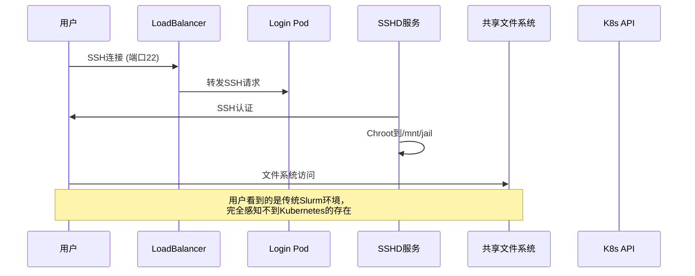

**关键实现机制**：
- **Login Pod**: 运行SSHD服务，配置`ChrootDirectory /mnt/jail`
- **共享文件系统**: 所有Pod挂载同一个PVC到`/mnt/jail`
- **透明访问**: 用户SSH会话自动进入共享环境，感知不到容器边界

### 2. 作业提交流程数据流

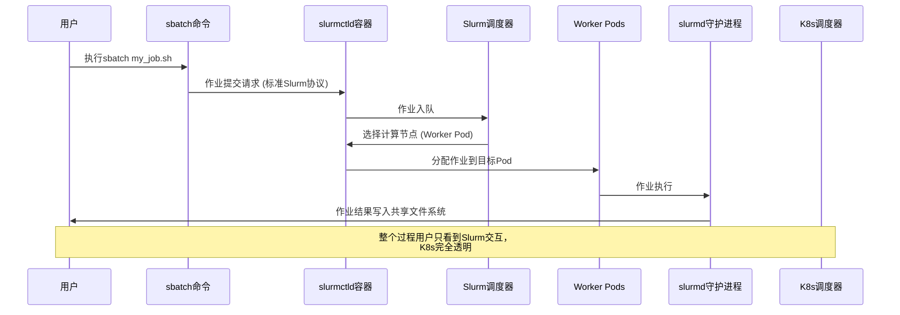

**透明性实现**：
- **协议兼容**: 使用标准Slurm协议，用户无需感知API转换
- **节点抽象**: 用户看到的是传统节点名，而非Pod名
- **状态同步**: Slurm状态实时同步，用户查询获得传统格式结果

### 3. 共享文件系统架构

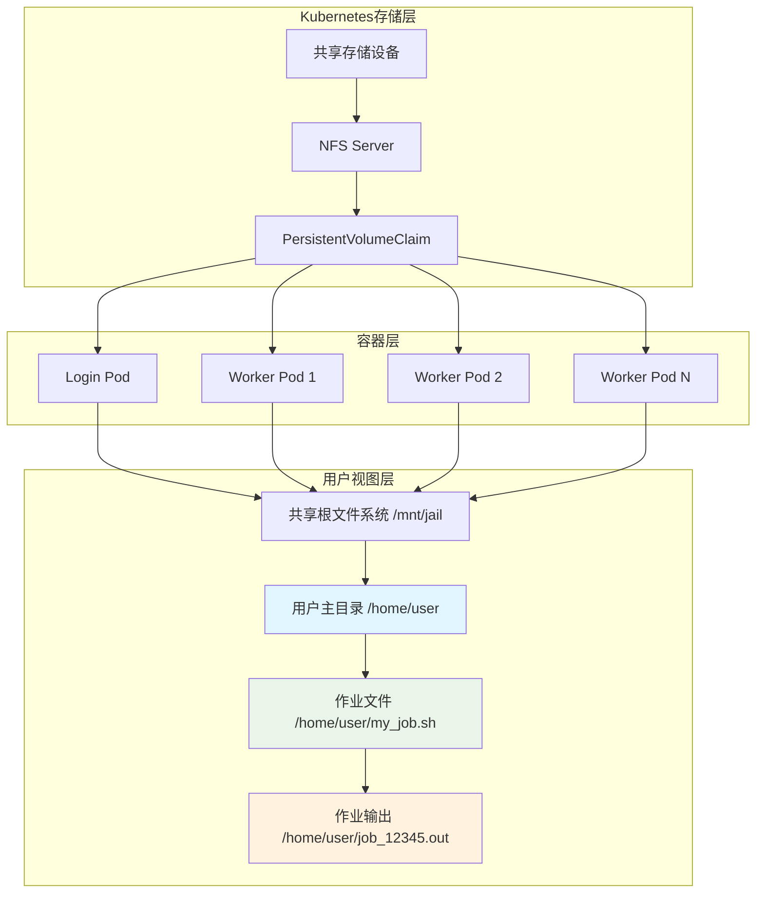

**共享机制详解**：
- **统一挂载点**: 所有Pod将PVC挂载到`/mnt/jail`
- **文件系统一致性**: 用户在任何节点看到相同的文件系统视图
- **数据无需传输**: 作业文件和输出都在同一文件系统中，无需额外传输步骤

### 4. 双层调度机制详解

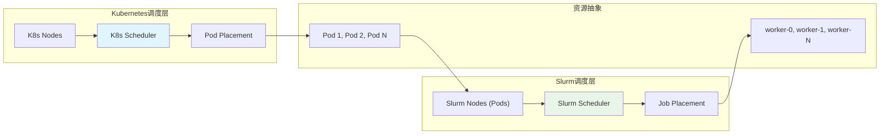

**调度分工策略**：
- **K8s调度器**: 负责Pod到物理节点的调度（基础设施层）
- **Slurm调度器**: 负责作业到Slurm节点的调度（应用层）
- **两层解耦**: 各司其职，互不干扰，用户只感知Slurm调度

### 5. 核心机制：slurmctld如何"误以为"在管理物理节点

**关键问题**：Soperator没有修改原生slurmctld程序，如何让它按照Pod调度？

**答案**：通过精心设计的**适配层**，让slurmctld"以为"自己在管理传统的物理节点集群。

#### 5.1 网络层伪装机制 🌐

**Headless Service + DNS解析**：
```yaml
# 生成的slurm.conf中的节点定义
NodeName=gb200-0-0 NodeAddr=gb200-0-0.gb200-0.soperator.svc RealMemory=1612639
```

**解析过程**：
1. slurmctld需要连接节点 `gb200-0-0.gb200-0.soperator.svc`
2. Kubernetes DNS将此域名解析为对应Pod的IP地址
3. slurmctld通过标准网络协议连接Pod中的slurmd进程
4. 从slurmctld视角看，这就是普通的物理节点连接

**关键实现**：[`internal/render/worker/service.go:24`](internal/render/worker/service.go#L24)
```go
func RenderService(namespace, clusterName string, worker *values.SlurmWorker) corev1.Service {
    return corev1.Service{
        Spec: corev1.ServiceSpec{
            ClusterIP: "None",  // 关键：Headless Service
            // ...
        },
    }
}
```

#### 5.2 配置层动态生成 ⚙️

**slurm.conf自动生成**：[`internal/render/common/configmap.go:118-140`](internal/render/common/configmap.go#L118-L140)

```go
func AddNodesToSlurmConfig(res *renderutils.PropertiesConfig, cluster *values.SlurmCluster) {
    for _, nodeSet := range cluster.NodeSetList.Items {
        for i := int32(0); i < nodeSet.Spec.Replicas; i++ {
            nodeName := fmt.Sprintf("%s-%d", nodeSet.Name, i)
            // 关键：使用Kubernetes服务发现机制
            nodeAddr := fmt.Sprintf("%s.%s.%s.svc", nodeName, nodeSet.Name, nodeSet.Namespace)
            realMemory := strconv.FormatInt(RenderRealMemorySlurmd(corev1.ResourceRequirements{Requests: nodeSet.Spec.Slurmd.Resources}), 10)
            res.AddProperty("NodeName", fmt.Sprintf(
                "%s NodeHostname=%s NodeAddr=%s RealMemory=%s %s",
                nodeName, nodeName, nodeAddr, realMemory, nodeSet.Spec.NodeConfig.Static,
            ))
        }
    }
}
```

**效果**：slurmctld读取到完全标准的slurm.conf，包含所有节点的详细配置

#### 5.3 Pod中运行原生slurmd 📦

**真正的slurmd进程**：
```dockerfile
# images/worker/Dockerfile
ENTRYPOINT ["/slurmd_entrypoint.sh"]
CMD ["slurmd"]
```

**环境变量注入**：[`internal/render/worker/container.go:142-214`](internal/render/worker/container.go#L142-L214)
```go
func renderSlurmdEnv(...) []corev1.EnvVar {
    envVar := []corev1.EnvVar{
        {
            Name: "K8S_POD_NAME",
            ValueFrom: &corev1.EnvVarSource{
                FieldRef: &corev1.ObjectFieldSelector{
                    FieldPath: "metadata.name",
                },
            },
        },
        {
            Name: "K8S_SERVICE_NAME",
            Value: naming.BuildServiceName(consts.ComponentTypeWorker, clusterName),
        },
        // 更多Pod信息注入...
    }
}
```

**动态节点注册**：[`images/worker/slurmd_entrypoint.sh:45-54`](images/worker/slurmd_entrypoint.sh#L45-L54)
```bash
if [ "${SOPERATOR_NODE_SETS_ON}" = "true" ]; then
  echo "Running slurmd with NodeSets configuration from slurm.conf"
else
  echo "Running slurmd with dynamic node configuration"
  slurmd_args+=(
    -Z
    --conf
    "NodeHostname=${K8S_POD_NAME} NodeAddr=${K8S_POD_NAME}.${K8S_SERVICE_NAME}.${K8S_POD_NAMESPACE}.svc RealMemory=${SLURM_REAL_MEMORY} Gres=${GRES} $(feature_conf)"
  )
fi
```

#### 5.4 启动顺序协调 🔄

**就绪等待机制**：[`images/worker/wait-for-controller.sh:18-25`](images/worker/wait-for-controller.sh#L18-L25)
```bash
if scontrol_output=$(scontrol ping 2>&1); then
    echo "Controller is ready!"
    exit 0
fi
```

**初始化容器**：[`internal/render/worker/statefulset.go:52-56`](internal/render/worker/statefulset.go#L52-L56)
```go
initContainers := []corev1.Container{
    common.RenderContainerMunge(&worker.ContainerMunge),
    RenderContainerWaitForController(&worker.ContainerSlurmd), // 等待控制器就绪
}
```

#### 5.5 完整的"欺骗"链条 🎯

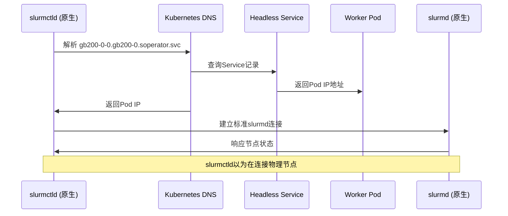

#### 5.6 关键技术总结

**适配层组件**：
- **网络适配**：Headless Service + Kubernetes DNS
- **配置适配**：动态生成标准slurm.conf
- **进程适配**：Pod中运行原生slurmd
- **存储适配**：共享PVC + chroot机制
- **时序适配**：init容器确保启动顺序

**"错觉"的实现**：
1. slurmctld看到标准的slurm.conf配置
2. 通过DNS可以解析到"节点"IP地址
3. 可以与"节点"上的slurmd正常通信
4. 共享文件系统让作业正常执行

**核心洞察**：Soperator没有修改任何Slurm核心组件，而是通过Kubernetes原生机制构建了一个完整的**节点模拟环境**，让原生slurmctld"无缝"地在Pod环境中运行。

## 🔧 关键技术实现详解

### 1. SPANK插件实现透明隔离

**文件位置**: `images/common/chroot-plugin/chroot.c`

```c
// 关键代码片段：SPANK插件初始化
int slurm_spank_init(spank_t sp, int ac, char **av) {
    // 注册作业初始化回调
    spank_register_callback(sp, S_JOB_INIT, job_init_callback);
    return 0;
}

// 作业初始化时的chroot操作
int job_init_callback(spank_t sp, int ac, char **av) {
    // 1. 创建新的mount namespace
    unshare(CLONE_NEWNS);

    // 2. 私有化当前mount namespace
    mount("none", "/", NULL, MS_REC|MS_PRIVATE, NULL);

    // 3. 绑定挂载关键目录
    mount("proc", "/mnt/jail/proc", "proc", MS_NOSUID|MS_NOEXEC|MS_NODEV, NULL);
    mount("sysfs", "/mnt/jail/sys", "sysfs", MS_NOSUID|MS_NOEXEC|MS_NODEV, NULL);

    // 4. 切换根目录
    pivot_root("/mnt/jail", "/mnt/jail/.pivot_root");

    // 5. 进入新的根目录
    chroot(".");
    chdir("/");

    return 0;
}
```

**透明效果**：
- **自动隔离**: 作业运行时自动进入共享文件系统环境
- **统一视图**: 用户和作业看到的都是统一的文件系统视图
- **系统隔离**: 系统目录（/proc, /sys等）仍保持隔离，确保安全

### 2. 容器网络透明化

**DNS配置策略**：
```yaml
# Worker Pod的DNS配置
dnsConfig:
  searches:
    - worker-0.slurm-cluster.gpu-cluster.svc.cluster.local
    - login.slurm-cluster.gpu-cluster.svc.cluster.local
  nameservers:
    - 10.96.0.10  # K8s DNS服务
```

**服务发现机制**：
```yaml
# Slurm控制器服务
apiVersion: v1
kind: Service
metadata:
  name: slurm-cluster-controller
spec:
  selector:
    app.kubernetes.io/component: controller
  ports:
    - port: 6817  # slurmctld端口
      targetPort: 6817
```

**网络透明效果**：
- **Pod间通信**: 通过K8s服务发现通信，用户看到传统节点名
- **端口映射**: 暴露标准Slurm端口，保持协议兼容性
- **DNS解析**: 传统节点名自动解析到Pod IP，用户无感知

### 3. 作业执行环境一致性

**容器启动脚本**: `images/worker/slurmd_entrypoint.sh`

```bash
#!/bin/bash

# 1. 等待共享文件系统就绪
while [ ! -d /mnt/jail ]; do
    echo "Waiting for jail filesystem..."
    sleep 1
done

# 2. 绑定挂载Slurm二进制文件到jail
mount --bind /usr/bin/slurmd /mnt/jail/usr/bin/slurmd
mount --bind /usr/lib/slurm /mnt/jail/usr/lib/slurm

# 3. 启动slurmd守护进程
exec /usr/sbin/slurmd -D -S /var/run/slurmd/slurmd.sock
```

**用户环境一致性验证**：
```bash
# 用户SSH登录后看到的环境
$ which sbatch
/usr/bin/sbatch  # 实际位于/mnt/jail/usr/bin/sbatch

$ sinfo
PARTITION AVAIL  TIMELIMIT  NODES  STATE NODELIST
gpu*         up   infinite      4  idle  worker-[0-3]

$ squeue
             JOBID PARTITION     NAME     USER ST       TIME  NODES NODELIST(REASON)
             12345    gpu*  my_job   user    R       0:10      1 worker-2
```

## 🎯 透明性实现的关键要素

### 1. 文件系统透明性

| 实现机制 | 透明效果 | 用户感知 |
|----------|----------|----------|
| **统一视图** | 所有节点访问同一文件系统 | ✅ 看到传统文件系统 |
| **路径一致性** | 与传统Slurm相同的路径结构 | ✅ 路径完全相同 |
| **权限一致性** | 保留标准UNIX权限模型 | ✅ 权限管理无变化 |

### 2. 网络透明性

| 实现机制 | 透明效果 | 用户感知 |
|----------|----------|----------|
| **服务发现** | 使用传统主机名而非K8s服务名 | ✅ 主机名无变化 |
| **端口映射** | 暴露标准Slurm端口 | ✅ 端口访问无变化 |
| **DNS解析** | 自动解析节点名到Pod IP | ✅ 网络访问透明 |

### 3. 命令透明性

| 实现机制 | 透明效果 | 用户感知 |
|----------|----------|----------|
| **二进制兼容** | 标准Slurm命令 | ✅ 命令完全相同 |
| **参数兼容** | 所有sbatch/srun参数完全相同 | ✅ 参数无变化 |
| **输出格式** | 与传统Slurm相同的输出格式 | ✅ 输出格式一致 |

### 4. 状态透明性

| 实现机制 | 透明效果 | 用户感知 |
|----------|----------|----------|
| **作业状态** | 实时同步Slurm作业状态 | ✅ 状态查询无变化 |
| **节点状态** | 显示传统节点信息而非Pod信息 | ✅ 节点视图一致 |
| **资源状态** | 显示CPU/GPU使用情况 | ✅ 资源监控无变化 |

## 🚀 核心技术创新分析

### 1. 共享根文件系统架构

**创新点**: 通过OverlayFS + 绑定挂载，在容器环境中重现传统Slurm集群的文件系统体验

**技术实现架构**：
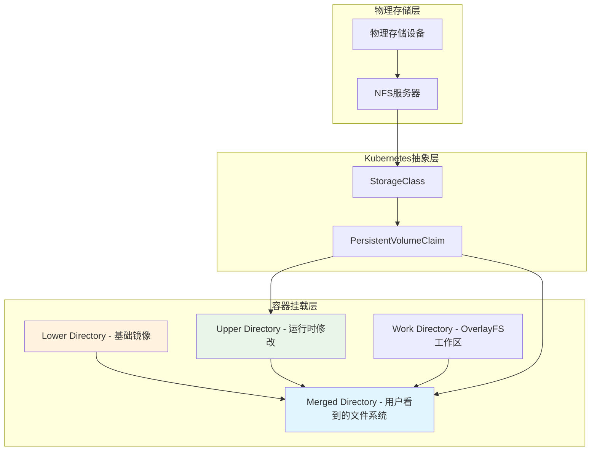

**透明性优势**：
- ✅ 用户看到统一的文件系统视图
- ✅ 作业数据无需额外传输
- ✅ 支持传统Slurm的共享文件系统依赖
- ✅ 完全保持文件系统使用习惯

### 2. 双层调度解耦机制

**创新点**: Kubernetes调度器管理基础设施，Slurm调度器管理作业，两层完全解耦

**调度流程对比**：

| 调度层级 | 传统Slurm | Soperator |
|----------|-----------|-----------|
| **资源管理** | 物理节点 | Kubernetes Pods |
| **调度器** | slurmctld | K8s Scheduler + slurmctld |
| **调度单位** | 物理节点 | Pod（基础设施）→ Slurm节点（作业） |
| **扩展性** | 手动添加节点 | 自动扩缩容Pod |
| **用户感知** | 直接感知物理节点 | 感知虚拟节点，Pod完全透明 |

### 3. SPANK插件隔离机制

**创新点**: 通过SPANK插件在作业运行时动态创建隔离环境，实现"容器的容器化"

**SPANK插件工作流程**：
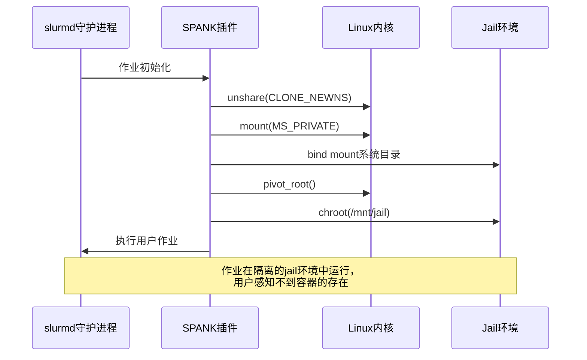

## 🔄 完整的用户作业生命周期

### 从用户视角的完整流程

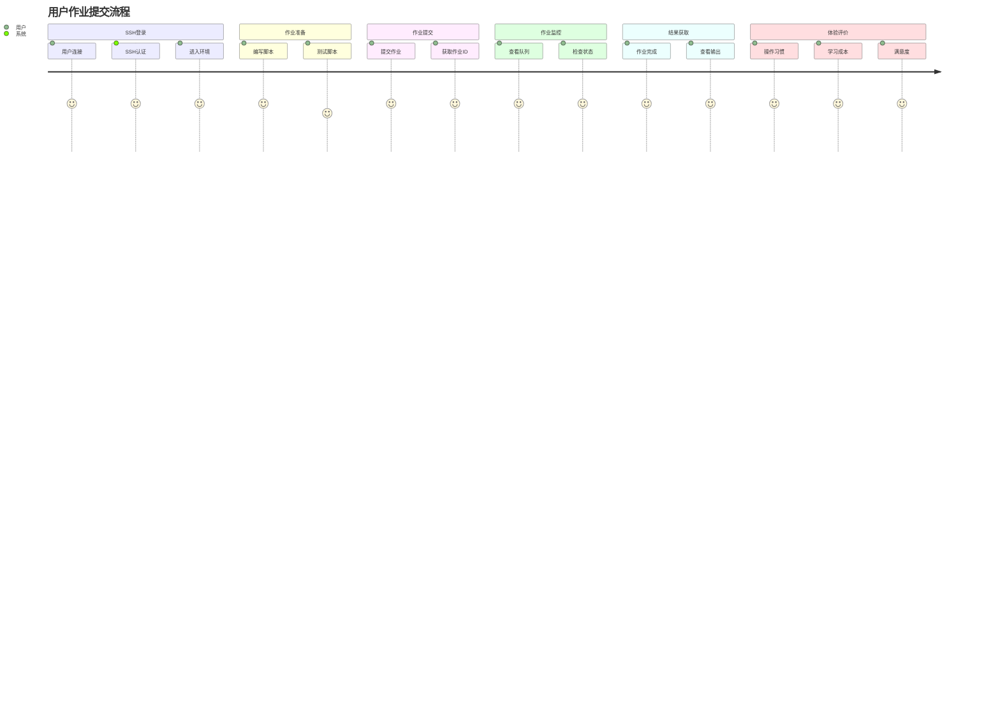

### 底层系统对应的操作

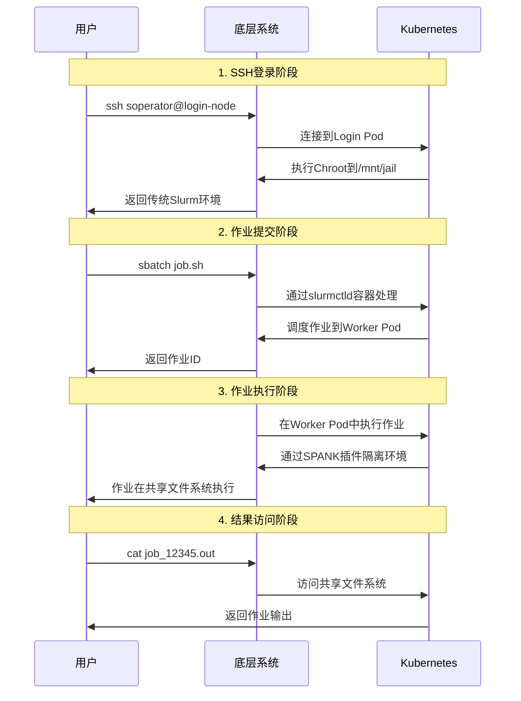

## 📈 与传统Slurm的对比优势

### 透明性保持度对比

| 体验维度 | 传统Slurm集群 | Soperator | 透明度评分 |
|----------|---------------|-----------|------------|
| **SSH登录** | 直接登录物理节点 | 登录Login Pod | ⭐⭐⭐⭐⭐ |
| **命令使用** | 标准Slurm命令 | 完全兼容 | ⭐⭐⭐⭐⭐ |
| **文件访问** | 本地/共享文件系统 | 共享文件系统 | ⭐⭐⭐⭐⭐ |
| **作业提交** | sbatch/srun | 完全兼容 | ⭐⭐⭐⭐⭐ |
| **状态查询** | squeue/sinfo | 完全兼容 | ⭐⭐⭐⭐⭐ |
| **环境变量** | 标准Slurm环境变量 | 完全兼容 | ⭐⭐⭐⭐⭐ |
| **配置文件** | 标准slurm.conf | 完全兼容 | ⭐⭐⭐⭐⭐ |

### 运维优势对比

| 维度 | 传统Slurm集群 | Soperator |
|------|---------------|-----------|
| **部署复杂度** | 手动配置，复杂度高 | 自动化部署，简单快速 |
| **扩展性** | 手动添加节点，耗时 | 自动扩缩容，分钟级 |
| **故障恢复** | 手动排查和修复 | 自愈能力，自动恢复 |
| **资源利用率** | 静态分配，利用率低 | 动态调度，利用率高 |
| **运维成本** | 高，需专职运维 | 低，自动化运维 |
| **监控能力** | 基础监控 | 全方位监控和告警 |
| **多租户** | 复杂的权限管理 | 原生K8s多租户支持 |

## 🔍 监控和可观测性

### 双层监控体系

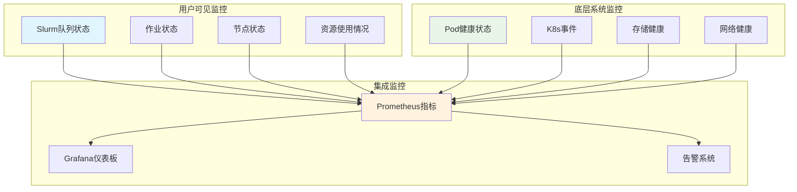

### 指标集成实现

```go
// Prometheus指标导出实现
func (e *ClusterExporter) CollectJobsMetrics() {
    jobs, err := e.client.ListJobs(ctx)
    for _, job := range jobs {
        // 作业数量统计
        prometheusJobsTotal.WithLabelValues(job.Partition).Inc()

        // 作业运行时间
        prometheusJobsRuntime.WithLabelValues(job.State).Set(job.Runtime)

        // 作业资源使用
        prometheusJobsCPU.WithLabelValues(job.JobID).Set(job.CPUUsage)
        prometheusJobsMemory.WithLabelValues(job.JobID).Set(job.MemoryUsage)
    }
}

// 节点状态指标
func (e *ClusterExporter) CollectNodesMetrics() {
    nodes, err := e.client.ListNodes(ctx)
    for _, node := range nodes {
        // 节点状态统计
        prometheusNodesState.WithLabelValues(node.State).Inc()

        // 节点资源使用
        prometheusNodesCPU.WithLabelValues(node.Name).Set(node.CPUAlloc)
        prometheusNodesMemory.WithLabelValues(node.Name).Set(node.MemoryAlloc)
    }
}
```

## 🎯 最佳实践建议

### 1. 保持透明性的配置原则

#### 文件系统配置
```yaml
# 保持传统路径结构
volumeMounts:
  - name: jail
    mountPath: /mnt/jail
  - name: slurm-bin
    mountPath: /usr/bin/slurm-bin
```

#### 网络配置
```yaml
# 保持传统主机名解析
dnsConfig:
  searches:
    - worker.slurm-cluster.local  # 传统格式
    - login.slurm-cluster.local
```

#### 环境变量配置
```bash
# 保持标准Slurm环境变量
export SLURM_CONF=/etc/slurm/slurm.conf
export SLURM_JOB_ID=$SLURM_JOB_ID
export SLURM_NTASKS=$SLURM_NTASKS
```

### 2. 用户体验验证检查清单

- [ ] SSH登录后显示传统Slurm环境提示
- [ ] `which sbatch` 返回标准路径 `/usr/bin/sbatch`
- [ ] `sinfo` 显示传统节点列表格式
- [ ] `squeue` 显示标准作业队列格式
- [ ] 作业提交后获得标准作业ID格式
- [ ] 作业输出文件位置与传统一致
- [ ] 环境变量 `$SLURM_*` 正常工作
- [ ] 所有标准Slurm命令正常执行

### 3. 故障排查指南

#### 透明性问题排查
```bash
# 1. 检查共享文件系统挂载
kubectl exec -it login-0 -n cluster -- df -h | grep jail

# 2. 验证Slurm二进制文件可访问性
kubectl exec -it login-0 -n cluster -- which sbatch

# 3. 检查节点注册状态
kubectl exec -it login-0 -n cluster -- sinfo

# 4. 验证作业调度功能
kubectl exec -it login-0 -n cluster -- sbatch --test-only test_job.sh
```

#### 网络透明性排查
```bash
# 1. 检查DNS解析
kubectl exec -it login-0 -n cluster -- nslookup worker-0

# 2. 验证服务连通性
kubectl exec -it login-0 -n cluster -- telnet slurmctld 6817

# 3. 检查节点间通信
kubectl exec -it worker-0 -n cluster -- ping worker-1
```

## 🎯 总结：透明性实现的核心价值

### 三大支柱实现完全透明

1. **共享根文件系统**: 通过OverlayFS + SPANK插件，在容器中重现传统文件系统体验
2. **双层调度解耦**: K8s调度器管理基础设施，Slurm调度器管理作业，各司其职
3. **网络映射透明**: 传统主机名自动映射到K8s服务，网络访问完全透明

### 用户体验零变化

- ✅ **学习成本为零**: 无需学习新的工具和命令
- ✅ **迁移成本为零**: 现有脚本和流程完全兼容
- ✅ **操作习惯为零变化**: 所有操作方式保持一致
- ✅ **心智模型零改变**: 用户思维模式无需调整

### 技术创新价值

Soperator最大的技术创新在于**成功将传统HPC调度系统容器化，同时完全保持了用户体验**。这意味着传统HPC用户能够无缝享受云原生技术带来的好处：

- **弹性能力**: 获得云原生的扩缩容能力
- **可靠性**: 具备容器化环境的自愈能力
- **运维效率**: 享受K8s的自动化运维能力
- **资源利用率**: 动态调度提升资源使用效率

这种架构让传统HPC用户能够无缝享受云原生技术带来的好处，是HPC容器化领域的一个重要突破。它证明了复杂的传统系统可以在不牺牲用户体验的前提下，完全拥抱云原生技术栈。

---

*本文档详细分析了Soperator如何实现用户透明机制，为理解传统HPC系统云原生化的技术实现提供了完整的参考。*